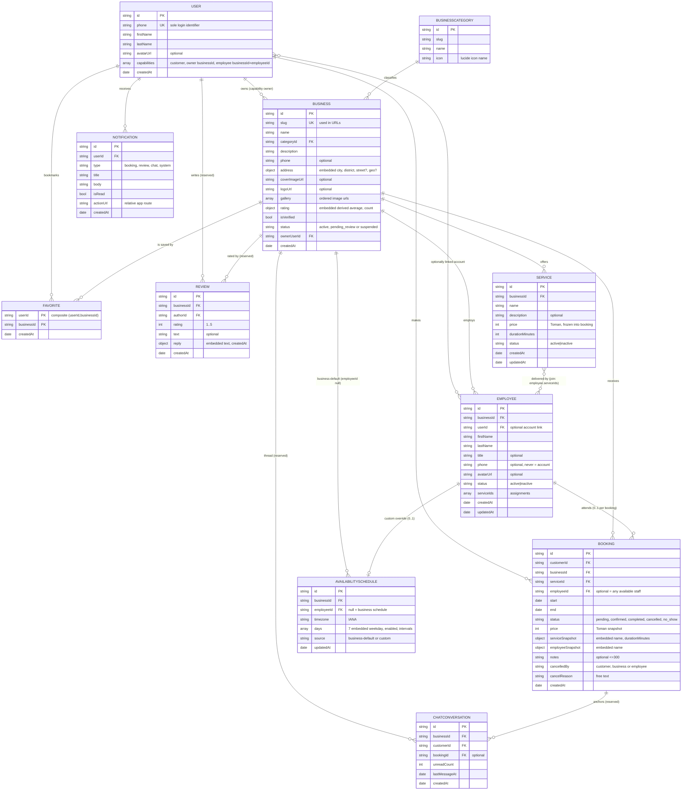
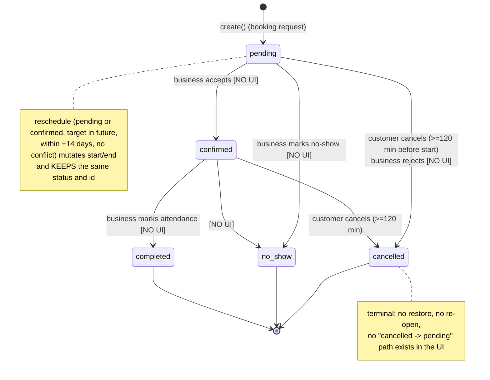
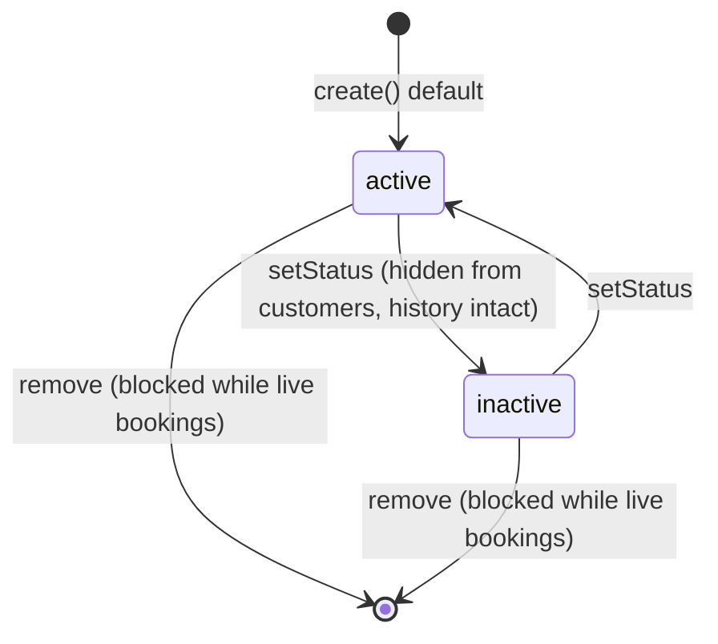
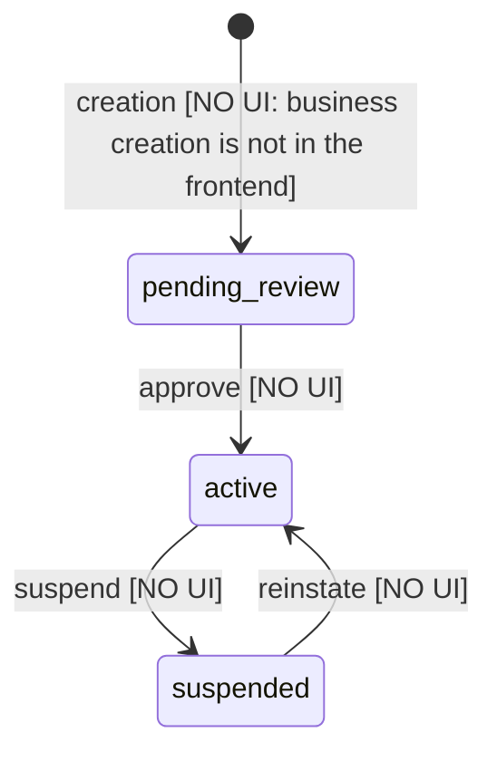
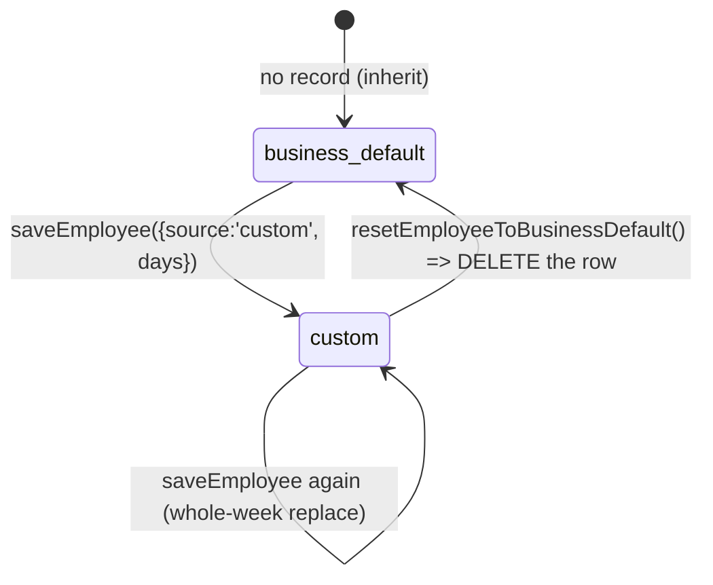

# Waqtino Backend & Data Specification

> **Status:** derived from the finished frontend (`main` @ Phase 12, commit `2d2587b`).
> **Authority:** for anything that contradicts `app/types/**` or `app/services/**/*-service.ts`, the **code is right** and this document must be corrected.
> **Rule of this document:** nothing here is invented. Where the frontend does not answer a question, the answer is the literal marker `BACKEND DECISION REQUIRED` — never a silent assumption.
> Companion docs: `docs/API-CONTRACT.md` (integration-level method tables), `docs/ARCHITECTURE.md` (frontend layering), `docs/DESIGN-SYSTEM.md` (visual/interaction rules), `README.md` (mock-data map and test matrix).

---

## 1. Executive Summary

Waqtino (وقتینو) is a **Persian-first, mobile-first reservation platform**: customers discover local businesses, pick a service and optionally a specific staff member, then reserve a time slot that the business derives from a **recurring weekly working-hours schedule**.

The frontend is complete for 12 phases and contains **no data layer of its own**: every read/write goes through a service contract (`app/services/**`), implemented today by in-browser mocks backed by cookies. That makes the frontend a *behavioural specification* of the backend: each contract method is an operation the API must supply, and each mock rule is a validation the API must re-enforce.

Key facts the backend must internalise:

| Fact | Where it comes from | Consequence for the backend |
| --- | --- | --- |
| One `User` entity with **capabilities**, not roles | `types/user.ts` | Identity, ownership and employment are separate relations, never a single `role` column |
| Availability is stored as **windows**, never as slots | `types/availability.ts` §intro | Slot generation is a *derived* read, computed at query time |
| A booking **snapshots** service name + duration, employee name and price | `types/booking.ts` | Renaming/deleting a service or employee must never rewrite history |
| Reschedule **mutates the existing booking in place** | `MockBookingService.reschedule` | No "cancel + create" chains; id, notes and history survive |
| Cancellation is governed by a policy (120 min before start) | `config/booking-policy.ts` | The same numbers must be enforced server-side, ideally per business |
| Every read has an explicit state: `AppLoadingState`, `AppEmptyState`, `AppErrorState`, plus offline (`AppOfflineState`/`AppOfflineBanner`) and owner access states (`OwnerAccessState`) | `components/states/**`, `components/owner/OwnerAccessState.vue` | Absence of data ≠ error ≠ permission-denied: `null`, `[]`, `403` and `404` must stay distinct on the wire |
| Internal identifiers are never exposed to customers | `toBookableEmployee()` | Read models must be projections, not row dumps |

Target backend: **AdonisJS + Prisma + MongoDB** (§29, §30, §42, §44).

---

## 2. Product Overview

**Actors (capabilities of one account, not three user types):**

| Capability | Frontend mode | What it can do today |
| --- | --- | --- |
| `customer` | `customer` | browse/search businesses, view services & staff, favourite businesses, create/cancel/reschedule own bookings, manage own profile & avatar |
| `owner` (per business) | `business` | dashboard, business info, manage services (CRUD + status), manage employees (CRUD + status + service assignment), manage weekly hours (business + per employee), view bookings |
| `employee` (per business) | `employee` | **placeholder only** — `pages/employee/*.vue` render `AppPlaceholderPage`; no data access, no UI feature |

**Screens that define product surface** (36 route files; `definePageMeta` is the access contract):

```text
customer  / /search /saved /business/[id] /booking /booking/success
          /bookings /bookings/[id] /bookings/[id]/reschedule
account   /login /login/otp /profile /profile/edit /settings /notifications
owner     /owner /owner/businesses
          /owner/business/[businessId]{,/info,/manage}
          /owner/business/[businessId]/services{,/new,/[serviceId](/edit)}
          /owner/business/[businessId]/employees{,/new,/[employeeId](/edit)}
          /owner/business/[businessId]/availability{,/business,/employees/[employeeId]}
employee  /employee{,/schedule,/bookings,/more}      (placeholders)
dev       /dev/design                                  (dev-only tooling)
```

**Not in the product today (do not build endpoints for them):** payments, reviews submission, chat messaging, push notification inbox, employee self-service, business onboarding/creation, holidays & exceptions, multi-currency, i18n beyond Persian. The frontend declares contracts for `reviews`, `chat` and `notifications` but **no page consumes them** (§4.4, §41).

---

## 3. Technology Context

| Technology | Version (package.json) | Why it exists / where used | Effect on backend architecture |
| --- | --- | --- | --- |
| **Nuxt** | `^4.5.2` | SSR + file-based routing + `runtimeConfig`; app is served from `app/` | Frontend talks to the API only inside `app/services/**` via `config.public.apiBaseUrl`. No proxy/secret exposure in the repo |
| **Vue** | `^3.5.13` | Components, `ref/computed`, `useState` for shared state | none |
| **vue-router** | `^5.3.0` | `definePageMeta` (`access`, `capability`, `tabbar`, `header`) drives `middleware/guard.global.ts` | Route guards are UX only. **Server must re-authorize every call** |
| **TypeScript** | `~5.9.0`, `strict`, `typeCheck: true` | Domain types in `app/types/**` are the de-facto schema vocabulary; 0 `any` in `app/` | Types are the DTO starting point (§27). `null` vs `undefined` distinction is load-bearing (§27) |
| **@nuxt/ui** | `^4.11.0` | All primitives (`UButton`, `USheet`, `UToast`, `USkeleton`, `UBadge`) behind thin `Wq*` wrappers | none |
| **@iconify-json/lucide** | `^1.2.126` | Only icon source, bundled locally (`icon.provider: server`, `serverBundle: 'local'`, `fallbackToApi: false`) | `BusinessCategory.icon` stores a **lucide name string**; if the backend supplies its own icon keys, map them in the service layer |
| **@fontsource-variable/vazirmatn** | `^5.3.0` | Self-hosted Persian font (`ui.fonts: false`, no external font service) | none |
| **@nuxtjs/color-mode** (via `@nuxt/ui`) | `colorMode.storageKey: 'wq-color-mode'` | Theme preference `system/light/dark` | none |
| **@nuxt/eslint / vue-tsc** | dev | `npm run check` = lint + typecheck + build | CI for the frontend, not the API |
| **Capacitor** | **not installed** | Webview packaging readiness only: `viewport-fit=cover`, safe-area env() padding, `app/services/native/system-back.ts` (LIFO back stack; `@capacitor/app` imported inside `try`) | The API must work when the app is packaged: cookie/session strategy must survive a webview (see §15, `BACKEND DECISION REQUIRED` on cookie vs bearer) |
| State management | Nuxt `useState`, `useCookie`, plugin-level singletons — **no Pinia/Vuex** | Server-derived caches (`owner:services:*`, `booking:draft`, `saved:*`) are `useState` keyed per business | No client cache is authoritative; API must be safe to re-read |
| Date/time | **no library** — `Intl.DateTimeFormat('fa-IR')` wrappers in `app/utils/datetime.ts` (`formatFaDate/formatFaTime/formatFaDateTime/formatDateLabel/formatRelativeFa` via `Intl.DateTimeFormat('fa-IR')`), `app/utils/schedule-time.ts` (date keys, `HH:mm`), `app/utils/digits.ts` (digits), `app/utils/duration.ts` | `APP_TIMEZONE = 'Asia/Tehran'` is the single source of "what day is it" | Timezone policy is explicit in §20 |
| Validation | **no library** — `app/utils/validation.ts` (pure functions) | Same functions are used by forms *and* by mock services as "second defence" | §24: backend must implement the identical rule set server-side |
| Money | `type Toman = number` (integer) | No floats, no currency field anywhere in the domain | §21 |

No GraphQL, no websocket client, no infinite-query library, no service worker. Polling-free: reads happen on mount/user action.

---

## 4. Domain Inventory

### 4.1 Persisted entities (12)

| # | Entity | Frontend type(s) | Purpose | Primary id | Owned by | Mutability |
| --- | --- | --- | --- | --- | --- | --- |
| 1 | User | `AppUser` | Single identity for every capability | `id: EntityId` | self | profile mutable; `phone` immutable in UI |
| 2 | AuthSession | `AuthSession` | Issued credential + user snapshot | derived | user | created/destroyed, never edited |
| 3 | Business | `Business` | Provider venue | `id`, `slug` | owner user | most fields mutable; `ownerUserId` immutable |
| 4 | BusinessCategory | `BusinessCategory` | Taxonomy of businesses | `id`, `slug` | platform | reference data |
| 5 | Service | `BookableService` / `ManagedService` | A bookable offering of one business | `id` | business | mutable, `status` lifecycle, hard-delete policy-gated |
| 6 | Employee | `Employee` / `ManagedEmployee` / `BookableEmployee` | Staff of one business | `id` | business | mutable; relation to Service owns assignment |
| 7 | AvailabilitySchedule | `AvailabilitySchedule` (+ `ScheduleInput`) | Weekly working windows of business or employee | `(businessId, employeeId?)` | business | rewritten atomically per week-view; employee row may be absent (= inherit) |
| 8 | Booking | `Booking` | A reserved slot | `id` | customer (business-scoped) | `start/end/status/notes/cancel*` mutable per rules; parties immutable |
| 9 | Favorite | `Favorite` / `SavedBusiness` | User ↔ business bookmark | `(userId, businessId)` | user | created/removed; membership is the data |
| 10 | Review | `Review` (+`ReviewReply`) | Customer rating of a business | `id` | business (author-scoped) | **contract only** — no UI writes it |
| 11 | ChatConversation / ChatMessage | `ChatConversation`, `ChatMessage` | Customer↔business thread, optionally per booking | `id` | conversation | **contract only** — no UI writes it |
| 12 | AppNotification | `AppNotification` | Inbox item — **contract only** (`/notifications` is a placeholder) | `id` | user | read-flag mutable |

### 4.2 Value objects (embedded, never standalone rows)

`BusinessAddress`, `BusinessRating`, `GeoPoint`, `AvailabilityDay`, `AvailabilityInterval`, `ScheduleSummary`, `BookingServiceSnapshot`, `BookingEmployeeSnapshot`, `ServiceDeletePolicy`, `EmployeeRemovePolicy`, `EmployeeAccountLink`, `MockProfilePatch`(mock only), `OwnerBusinessMetrics`.

### 4.3 Read models / projections (11) — computed by the API, not stored

`BusinessWithDistance`, `OwnedBusiness`, `OwnerDashboard`, `OwnerBookingItem`, `BookingWithDetails`, `BusinessScheduleView`, `EmployeeScheduleSummary`, `EmployeeScheduleView`, `DayAvailability`, `DateAvailabilityEntry`, `TimeSlot`.

### 4.4 Reserved contracts (frontend declares, never consumes)

`ReviewService.listForBusiness`, `ChatService.listConversations/listMessages`, `NotificationService.listMine/unreadCount/markRead`, `FavoriteService.isSaved`, `AvatarService.listPresets`. The UI has no consumer for them; `pages/notifications.vue` and `pages/employee/*` explicitly say "not enabled yet". **Do not build these endpoints to satisfy the frontend** — they exist so the frontend can grow without architecture change.

---

## 5. User Model

```ts
type UserMode = 'customer' | 'business' | 'employee'          // UI experience switch, NOT a stored role

type UserCapability =
  | { kind: 'customer' }
  | { kind: 'owner';     businessId: EntityId }
  | { kind: 'employee';  businessId: EntityId, employeeId: EntityId }

interface AppUser {
  id: EntityId              // required, immutable, opaque
  phone: string             // required; the only login identifier in the product today
  firstName: string         // required (2..24 chars, no digits — see §24)
  lastName: string          // required (same rule)
  avatarUrl?: string | null // optional; null = "remove and fall back to initials"
  capabilities: UserCapability[]   // required, may be [] (a fresh signup is capability-free apart from customer)
  createdAt: ISODateTime    // required, immutable
}

interface AuthSession { user: AppUser; accessToken: string; issuedAt: ISODateTime; expiresAt: ISODateTime }
```

### 5.1 Four concepts the backend must keep separate

| Concept | Carrier | Lifetime | Frontend evidence |
| --- | --- | --- | --- |
| **Authentication identity** | `User.id` + `phone` + session | until logout | `AuthService.requestOtp/verifyOtp/logout/clearLocalSession`; `pages/login*` |
| **Business ownership** | capability `{kind:'owner', businessId}` ⇄ `Business.ownerUserId` | per business | `owner-access.ts` (`resolveOwnedBusiness`), all `/owner/**` pages |
| **Employee membership** | capability `{kind:'employee', businessId, employeeId}` ⇄ `Employee.userId` (optional link) | per business | `EmployeeAccountLink {state:'linked'\|'none', accountActive}` |
| **Customer activity** | `Booking.customerId`, `Favorite.userId`, `Review.authorId` | per record | `bookings.listMine`, `favorites.listMine` |

Notes that are contractual, not incidental:

- `Employee.userId` is **optional**: an employee record may exist with no Waqtino account, and one account may be staff at several businesses. `EmployeeAccountLink.accountActive` says whether the linked account can actually log in. **The exact linking flow is `BACKEND DECISION REQUIRED`** (§41-4).
- A user with no `customer` capability is not modelled: `UserMode` always includes customer when authenticated. The frontend derives modes purely from `capabilities` (`useUserMode.availableModes`).
- `phone` is never editable in the UI (`profile/edit.vue` shows it read-only). Change-of-phone flow: `BACKEND DECISION REQUIRED`.
- `firstName`/`lastName` are validated by `validateNamePart`: non-empty, no digits, only letters/spaces/ZWNJ, 2–24 grapheme-clusters. `AppUser.displayName` is never stored; `formatFullName()` derives it.
- The mock snapshot mechanism (`replaceSessionUser`) shows what the UI expects: after a profile write, the **session's user snapshot** must be refreshed by the same response (or by an immediate `GET /auth/me`) — otherwise the header keeps stale text.
- `accessToken` exists in the type but **the frontend never reads it**. It may drop out entirely if the backend uses an `HttpOnly` cookie (§15, §41-9).

### 5.2 Mode is a client preference, not server state

`wq_mode` cookie (`'customer' | 'business' | 'employee'`) + `useState('app:mode')` decide which UI the user sees, and `MODE_LANDING[mode]` the landing route. The API must not infer authorization from any mode hint; capability checks are per request (§26). `BACKEND DECISION REQUIRED`: whether the backend persists "last active mode" per user at all (the frontend is happy owning it).

---

## 6. Business Model

```ts
type BusinessStatus = 'active' | 'pending_review' | 'suspended'

interface Business {
  id: EntityId                 // required, immutable
  slug: string                 // required, presumably unique (frontend never asserts it — see §36)
  name: string                 // required, mutable
  categoryId: EntityId         // required, mutable — exactly ONE category (no array in the model)
  description: string          // required by type (may be ''), mutable
  phone?: string               // optional contact number, mutable
  address: BusinessAddress     // required embedded object
  coverImageUrl?: string | null
  logoUrl?: string | null
  gallery: string[]            // required (may be []), ordered, mutable
  rating: BusinessRating       // { average: number, count: number } — DERIVED, never written by UI
  isVerified: boolean          // platform flag, not owner-writable
  status: BusinessStatus       // lifecycle, platform-controlled
  ownerUserId: EntityId        // immutable in every frontend flow
  createdAt: ISODateTime       // immutable
}

interface BusinessAddress { city: string; district: string; street?: string; geo?: GeoPoint }
interface GeoPoint { lat: number; lng: number }
interface BusinessWithDistance extends Business { distanceKm: number }   // read model
```

### 6.1 Fields the frontend treats as derived (do not accept them from a client)

| Field | Evidence |
| --- | --- |
| `rating.average`, `rating.count` | `BusinessRating` is displayed (`WqRating`) but there is no write path in the UI; it comes from seeds. Recomputation rule: `BACKEND DECISION REQUIRED` (§41-11) |
| `isVerified`, `status` | only read; owner UI shows the badge (`business-status.ts`) and never edits it |
| `distanceKm` | computed from `geo` (`listNearby`) — today the mock uses a distance table |

### 6.2 Business-owned aggregates reachable from a business

`Service[]` (§8), `Employee[]` (§9), `AvailabilitySchedule` business-default (§10), `Booking[]` (§11), `Review[]`, `ChatConversation[]`, plus *favorited-by* reverse relation (§12). There is **no `Business.settings` object in the model** — see §10.5 and §41-3 for the missing policy fields (cancellation window, booking horizon, slot step). The only per-business settings-ish values the frontend knows are `rating`, `status`, `isVerified`, `gallery`, `address`.

### 6.3 Lifecycle (frontend-observed)

`pending_review → active` and `active → suspended` are assumed to be platform actions (admin), never UI actions. The frontend: `list`/search only return `status === 'active'` (`MockBusinessService.list` filters them); `/owner/business/[id]/*` shows the other states to their owner with an explanatory badge. **Who may change it: `BACKEND DECISION REQUIRED`** (no admin panel exists in this frontend).

### 6.4 Images

`logoUrl`, `coverImageUrl`, `gallery[]` are plain URL strings; `WqAvatar`/business hero handle broken URLs with a fallback (initials/placeholder), so the backend may return a stale URL without breaking the UI. Upload flow for business images **does not exist in the frontend** (owner can only edit profile avatar) → `BACKEND DECISION REQUIRED` for business image endpoints.

---

## 7. Category Model

```ts
interface BusinessCategory { id: EntityId; slug: string; name: string; icon: string }
```

- `name` is Persian display text; `slug` exists for stable external references (frontend does not use it yet); `icon` is a **lucide icon name** consumed directly by `WqChip`/`BusinessCard*`.
- Relationship: `Business.categoryId` → exactly one category ⇒ **N:1**. A business with **multiple categories is not representable** in the current model. `BACKEND DECISION REQUIRED` (§41-2) if the product wants multi-category.
- **No status field, no ordering field, no parent/child** (flat list), no images. The frontend sorts by seed order (`listCategories()` returns the array as-is, and category chips are rendered in that order) → ordering must be an explicit backend decision (§41-2).
- Search/filter behaviour: `BusinessListQuery.categoryId` is a single-value filter (`businesses.list`), and `/search` puts the active category in the URL (`?category=`). There is no "category description" or landing-page requirement in the UI.
- Consumers: `/search`, `/` (discovery sections), owner service/employee screens (for context labels), business detail (label next to the name).

---

## 8. Service Model

```ts
type ServiceStatus = 'active' | 'inactive'

interface BookableService {          // the domain record (customer-facing shape)
  id: EntityId
  businessId: EntityId               // required; a service belongs to exactly one business
  name: string                       // 3..60 chars, letters/digits/() , / + - allowed
  description?: string               // optional, ≤200 chars — absence must not break display
  price: Toman                       // integer toman, 1_000..50_000_000
  durationMinutes: number            // integer, 5..480
  employeeIds?: EntityId[]           // DERIVED projection of Employee.serviceIds — never written directly
  status: ServiceStatus
  createdAt?: ISODateTime            // present only once really saved
  updatedAt?: ISODateTime
}

interface ServiceInput { name: string; description: string; durationMinutes: number; price: Toman; status: ServiceStatus }

interface ManagedService extends BookableService {   // owner view = record + decision data
  liveBookingCount: number           // pending/confirmed, in the future
  bookingCount: number               // all bookings referencing this service (history included)
  deletePolicy: { canDelete: boolean; blocker: 'has_live_bookings' | null; hint: string | null }
}
```

### 8.1 The one-truth rule for the employee↔service link

`Employee.serviceIds` is the **source of truth**; `BookableService.employeeIds` is a derived view built in the service layer (`resolveBusinessServices` + employee rows; see `types/service.ts` comment and `MockBusinessService.listServices`). Both directions are **N:M**; the backend must store one join, not two arrays (§30, §42).

### 8.2 Status semantics (load-bearing, per the frontend)

- `inactive` ⇒ hidden from customer listing (`listServices` filters) **and** rejected on fresh booking (`validateDraft` → `SERVICE_NOT_AVAILABLE`) **but** retained in owner management and in booking history. Deactivation ≠ deletion.
- `remove` is policy-gated (`SERVICE_DELETION_POLICY`): blocked while live bookings exist (`blockWhenLiveBookings: true`), allowed when only history remains (`allowWhenHistoryOnly: true`), `minAgeDaysBeforeDelete: null`. When blocked, the API must return a conflict with a **human Persian hint**; the UI shows it verbatim and offers "deactivate instead".

### 8.3 Duration & price are consumed by rules, not just display

- `durationMinutes` drives the **slot grid** (`buildSlots`: slots start at each interval's beginning and advance by exactly `durationMinutes`; a slot is only generated if it fits fully inside that interval) and the booking `end` computation, and `validateDraft` rejects `|(end−start) − durationMinutes| > 5`.
- `price` is the price the customer sees at booking time and is copied into `Booking.price` (see §14); a mismatch is a **warning** (`PRICE_CHANGED` + `suggestedPrice`), not an error, and `create` refuses until the client re-submits with the new price.

---

## 9. Employee Model

```ts
type EmployeeStatus = 'active' | 'inactive'

interface Employee {                 // the stored record (mock repository shape)
  id: EntityId
  businessId: EntityId               // required — an employee is always "of" one business
  userId?: EntityId                  // OPTIONAL link to an account (0..1 today, see below)
  firstName: string                  // 2..24, no digits
  lastName: string                   // 2..24, no digits
  title?: string                     // customer-facing job label, ≤40 chars
  phone?: string | null              // optional; never means "account"
  avatarUrl?: string | null
  status: EmployeeStatus
  serviceIds: EntityId[]             // REQUIRED source of truth for assignments (same business only)
  createdAt?: ISODateTime
  updatedAt?: ISODateTime
}

interface BookableEmployee {         // customer projection — a whitelist, not a row dump
  id: EntityId; businessId: EntityId; displayName: string
  title?: string; avatarUrl?: string | null
  status: EmployeeStatus; serviceIds: EntityId[]
}

interface ManagedEmployee extends Employee {
  displayName: string; activeServiceCount: number; orphanedServiceNames: string[]
  liveBookingCount: number; bookingCount: number
  removePolicy: { canRemove: boolean; blocker: 'has_live_bookings' | null; hint: string | null }
  linkedAccount: { state: 'linked' | 'none'; accountActive: boolean }
}
```

**Answer to "is an Employee a User?"** — In this architecture `Employee` is an **independent entity** scoped to a business, with an *optional* `userId` link. It is *not* `User + profile`: `firstName/lastName/title/avatarUrl` live on the employee row so a business can register staff who have no Waqtino account. `BookableEmployee` exists precisely so customer reads never carry `phone` or `userId`.

Consequences the backend must honour:

| Behaviour | Frontend evidence | Backend requirement |
| --- | --- | --- |
| Assignments are replaced wholesale | `assignServices(businessId, employeeId, serviceIds[])` | `PUT` semantics, and every `serviceId` must belong to the same business, else `404 notFound` (`resolveServiceIds`) |
| Duplicate ids in an assignment are de-duplicated | `[...new Set(serviceIds)]` | idempotent write; `BACKEND DECISION REQUIRED` whether uniqueness is also a DB constraint (§36) |
| Removing an employee may orphan a service | `orphanedServiceNames` = services this person covered and nobody else (active) covers | the delete response must let the owner see this; a service with zero active employees is still bookable "any available staff" (§11.3) |
| Status change never touches history | `setStatus` + `types/employee.ts` header | `inactive` removes from `BookableEmployee` list only |
| Name changes must not rewrite past bookings | `Booking.employeeSnapshot` | snapshot on write (§14) |
| Delete blocked while live bookings exist | `EMPLOYEE_REMOVAL_POLICY.blockWhenLiveBookings` | conflict + hint; `blockWhenAccountLinked: false` — unlinking an account is not a deletion blocker |
| `displayName` is derived | `employeeDisplayName()` (trims, collapses spaces, joins) | do not store a third name field |

**Employee-mode readiness:** the frontend's only forward hook is the `employee` capability `{businessId, employeeId}` plus `EmployeeAccountLink`. Whether a linked account can manage its own availability/bookings is `BACKEND DECISION REQUIRED` (§41-4).

---

## 10. Availability Model

### 10.1 Shape

```ts
type Weekday = 'saturday' | 'sunday' | 'monday' | 'tuesday' | 'wednesday' | 'thursday' | 'friday'   // Iranian week start

interface AvailabilityInterval { start: string; end: string }      // 'HH:mm', zero-padded, no seconds
interface AvailabilityDay { weekday: Weekday; enabled: boolean; intervals: AvailabilityInterval[] }

type ScheduleSource = 'business-default' | 'custom'

interface AvailabilitySchedule {
  businessId: EntityId
  employeeId?: EntityId          // present ONLY for a person's custom schedule
  timezone: string               // IANA, from APP_TIMEZONE today ('Asia/Tehran')
  days: AvailabilityDay[]        // always 7 entries after normalization
  source: ScheduleSource
  updatedAt?: ISODateTime
}

interface ScheduleInput { source: ScheduleSource; days?: AvailabilityDay[] }   // what the form sends
```

### 10.2 Three deliberate storage decisions (from `types/availability.ts`)

1. **Windows, not slots.** Nothing stores generated slots; `TimeSlot` is always computed (§22). Changing a schedule therefore never "orphan"s a list of times.
2. **Inheritance by absence.** An employee schedule row exists only when `source === 'custom'`. `business-default` means **no record** — `resetEmployeeToBusinessDefault` *deletes* the override instead of writing an empty copy (`MockAvailabilityManagementService`, `availability-state.ts`). The backend must model "no row" as a state, not as `days: []`.
3. **Canonical forms.** Day by name, time as `HH:mm` with no timezone; Persian labels/formatting live only in the display layer, so a second locale never mutates data.

### 10.3 The subset rule (validation the backend must implement)

```text
Employee custom schedule  ⊆  Business schedule      (per weekday, per interval)
```

Implemented once in `employeeScheduleConflictDays()` / `employeeScheduleConflictMessage()`:

- an employee interval is valid only if **fully contained** in one of the business intervals for that weekday (`containsInterval`, not "between first opening and last closing" — so a 12:00–14:00 lunch gap in the business schedule is a real boundary);
- if the business is closed on that weekday, **no** employee interval is accepted;
- if the business has **no schedule at all**, saving a custom employee schedule is refused with the hint "set business hours first" (`saveEmployee` → `ServiceError.validation`);
- `disabled day` keeps its `intervals` array untouched (so re-enabling never loses data) and `validateSchedule` only checks intervals of **enabled** days.

The consequence for slot generation: effective employee availability = `custom ∩ business` (`intersectDays`), computed inside `dayContext()`, which is what `EmployeeScheduleView.effective` reports to the owner (§10.3). Because that intersection lives in the engine, the "closed" message is also produced there and distinguishes «این نفر در این روز پذیرش ندارد» from «در این روز پذیرش نداریم» — the API must keep producing that distinction, since the customer UI renders the engine's `message` verbatim.

### 10.4 Weekly editing contract

- Saving a schedule is **whole-week, atomic** (`saveBusiness(businessId, days[])`, `saveEmployee(..., ScheduleInput)`): the form accumulates a draft and one write persists seven days. There is no per-day endpoint expectation and no partial update.
- Normalization inside `validateSchedule`: unknown weekday names ⇒ hard failure listing them; duplicate weekday ⇒ error; missing days ⇒ materialized as `{enabled: false, intervals: []}`; intervals sorted by start; `start >= end` rejected (never silently reversed); `end − start < 15 min` rejected; overlap rejected; `intervals.length > 4` rejected; enabled day with zero intervals rejected.
- Editor policy (`AVAILABILITY_POLICY`): `maxIntervalsPerDay: 4`, `minuteStep: 15`, `minIntervalMinutes: 15`, `disableDayWhenLastIntervalRemoved: true`. Overnight windows (18:00→09:00) are **rejected by design**, and `MAX_INTERVALS_PER_DAY`/`MINUTE_STEP` are frontend-editable defaults: **per-business slot granularity is `BACKEND DECISION REQUIRED`** (§41-6).
- A business with no schedule ⇒ `status: 'not-configured'` (a distinct availability state, not "closed", not "error", and not an error at booking time in the frontend's spirit of not being strict: `not-configured` yields no slots but `validateDraft` maps it to `SLOT_UNAVAILABLE` only when a message exists).

### 10.5 What is NOT modelled

Holidays, one-off overrides, vacation/day exceptions, recurring exceptions, capacity (2 chairs at the same time), buffer minutes between bookings, and business-specific cancellation/reschedule policy. The types are written so that an `exceptions` map keyed by date can sit beside `days` without changing the day model. Every one of these is `BACKEND DECISION REQUIRED` (§41-5, §41-3, §41-7).

---

## 11. Booking Model

```ts
type BookingStatus = 'pending' | 'confirmed' | 'completed' | 'cancelled' | 'no_show'
type BookingCancelledBy = 'customer' | 'business' | 'employee'

interface Booking {
  id: EntityId
  customerId: EntityId          // required, immutable after creation
  businessId: EntityId        // required, immutable after creation
  serviceId: EntityId         // required, immutable after creation
  employeeId?: EntityId       // optional: absent = "any available staff" (business-level slot)
  start: ISODateTime          // required, mutable only via reschedule
  end: ISODateTime            // required, must satisfy end-start ≈ Service.durationMinutes (±5 min)
  status: BookingStatus       // lifecycle (§18–19)
  price: Toman                // required — PRICE AT BOOKING TIME (snapshot, see §14)
  serviceSnapshot?: { name: string; durationMinutes: number }      // written at creation
  employeeSnapshot?: { name: string }                              // written at creation when an employee was chosen
  notes?: string              // optional customer note, ≤300 chars
  cancelledBy?: BookingCancelledBy
  cancelReason?: string       // free-form; UI offers 5 shortcuts (see below)
  createdAt: ISODateTime      // immutable
}

interface BookingWithDetails extends Booking {   // read model built by the frontend today
  businessName: string; serviceName: string; employeeName?: string
  businessCategoryName?: string; serviceDuration: number
}
```

There is **no `updatedAt`, `confirmedAt`, `completedAt`, `cancelledAt`, `rescheduledCount`, `originalStart`, `totalPrice/discount`, or `payment` field** on a booking. Whether to add them: §38 and §41-8.

### 11.1 Write operations the frontend performs (and the API must expose)

| Operation | Contract | Server-side rules the frontend already applies (mock) |
| --- | --- | --- |
| list mine | `listMine(scope?: 'upcoming'\|'past') → Booking[]` | `upcoming` = `start ≥ now` **and** status in (`pending`,`confirmed`), ascending; `past` = everything else, descending. Ownership = `customerId` |
| read one | `getById(id) → Booking \| null` | another user's booking ⇒ `null` (not 403) so existence is not leaked |
| validate draft | `validateDraft(req) → {valid, errors[], warnings[]}` | see rule list below |
| create | `create(req) → {success:true, bookingId} \| {success:false, error:{code,message,suggestedPrice?}}` where `code ∈ 'SLOT_UNAVAILABLE' · 'PRICE_CHANGED' · 'VALIDATION_ERROR' · 'SERVER_ERROR'` (the typed union; `NETWORK_ERROR` is *thrown*, not returned, when the dev force-error flag is on) | re-validates, then persists with `status:'pending'` |
| cancel | `cancel({bookingId, reason?}) → {success:true,message} \| {success:false,error}` | policy gate (§11.2) |
| reschedule | `reschedule({bookingId,newStart,newEnd}) → {success:true,booking} \| {success:false,error}` | re-check conflict excluding self; in-place patch |

Each `validateDraft` error also carries `field: 'business' | 'service' | 'employee' | 'date' | 'timeSlot'` (the UI jumps to that step), and the price warning is `{ type: 'price_change', code: 'PRICE_CHANGED' }`. Rule order (exact order matters): service exists in that business → service is `active` → (if given) employee exists in that business → employee is `active` → **employee is assigned to that service** → price equality (**warning** `PRICE_CHANGED`) → `|(end−start) − durationMinutes| ≤ 5` (`DURATION_MISMATCH`) → availability/conflict check via the slot engine (`DATE_IN_PAST`, `DAY_CLOSED`, `OUT_OF_HOURS`, `SLOT_UNAVAILABLE`).

### 11.2 Booking policy numbers (must be enforced identically on the server)

```ts
BOOKING_POLICY = {
  cancelMinMinutesBeforeStart: 120,                       // 'window' block
  cancellableStatuses:     ['pending', 'confirmed'],
  reschedulableStatuses:   ['pending', 'confirmed'],
  notesMaxLength: 300,
  rescheduleHorizonDays:   14                              // date picker window from today
}
BOOKING_CANCEL_REASONS = ['change-of-plan','found-elsewhere','wrong-time','emergency','other']  // labels, wire value is a free string
```

- `bookingCancelBlock()` returns `'cancelled' | 'status' | 'window' | null`; the service maps the same three to error codes `ALREADY_CANCELLED`, `PAST_BOOKING`, `POLICY_VIOLATION`.
- `bookingRescheduleBlock()` returns `'status' | 'past' | null` → `NOT_RESCHEDULABLE`, `TIME_IN_PAST`.
- `isLiveBooking(status)` = `pending | confirmed`: this exact set also defines "live bookings" for **service/employee deletion policy**, for owner `pendingCount`, and for slot occupancy. If the backend changes the set, all of these move together.
- Cancellation is allowed for the **customer** within the window; cancellation **by the business** (e.g. rejecting a `pending` request) has no UI, so the policy for it is `BACKEND DECISION REQUIRED` (§41-8).

### 11.3 "Any available staff" semantics

`employeeId` absent means the booking consumes a **business-level** slot: occupancy for such a request counts only other bookings without an employee (`bookingsOfDay`: `employeeId ? b.employeeId === employeeId : !b.employeeId`). This is a deliberate simplification and a **known product gap**: with staff assigned, the business-level slots do not consider staff capacity, and vice-versa. `BACKEND DECISION REQUIRED`: capacity semantics for unassigned bookings (§41-6).

---

## 12. Favorite Model

```ts
interface Favorite { userId: EntityId; businessId: EntityId; createdAt: ISODateTime }   // the membership
interface SavedBusiness { business: Business; savedAt: ISODateTime }                    // the read model
```

- Operation set: `listMine() → SavedBusiness[]` (sorted newest-first, entries whose business vanished are **dropped silently** by the mock), `toggle(businessId) → boolean` (returns the new state), `isSaved(businessId) → boolean` (declared, unused by the UI — the page uses a client-side set).
- `toggle` is a **set-or-unset**, so the API must be idempotent per user+business; uniqueness is `(userId, businessId)` (§36).
- Removal semantics in the frontend: **hard** (the row disappears; nothing is kept). The UI additionally offers an `undoRemove` that re-adds it with a fresh `savedAt` (`useSavedBusinesses`), so "undo" is a client nicety, not a soft delete. `BACKEND DECISION REQUIRED` whether a favourite removal should be soft-deleted for analytics (§41-10).
- Favouriting a business that is `suspended`/`pending_review`: the frontend does not prevent it (only requires auth) — `BACKEND DECISION REQUIRED`.
- There is no favorite folder/tag/collection concept, and no "count of how many users favourited a business" consumer (so a counter field is optional; §33).

---

## 13. Review, Notification & Chat Models (reserved contracts)

These three domains have complete TypeScript contracts and seed data, but **no page consumes them**. They are documented so the backend neither ignores the shapes nor over-builds UI-driven features around them.

```ts
type NotificationType = 'booking' | 'review' | 'chat' | 'system'
interface AppNotification {
  id: EntityId; userId: EntityId; type: NotificationType
  title: string; body: string; isRead: boolean
  actionUrl?: string          // in-app route the card deep-links to
  createdAt: ISODateTime
}
interface Review {            // NOTE: Favorite lives in this same file (types/review.ts)
  id: EntityId; businessId: EntityId; authorId: EntityId
  rating: 1 | 2 | 3 | 4 | 5   // integer literal union — the DB must constrain it
  text?: string
  reply?: { text: string; createdAt: ISODateTime }   // ONE reply, embedded, no thread
  createdAt: ISODateTime
}
interface ChatConversation {
  id: EntityId; businessId: EntityId; customerId: EntityId
  bookingId?: EntityId        // thread is opened "because of" a booking
  unreadCount: number
  lastMessageAt?: ISODateTime
  createdAt: ISODateTime
}
type MessageStatus = 'sent' | 'delivered' | 'read'
interface ChatMessage { id: EntityId; conversationId: EntityId; senderId: EntityId; text: string; status: MessageStatus; createdAt: ISODateTime }
```

Backend rules implied by the contracts:

| Rule | Evidence |
| --- | --- |
| `Business.rating{average,count}` is the **materialised view** of reviews; a review write must update it atomically | `types/business.ts` `BusinessRating` + `ReviewService.listForBusiness` is the only read |
| A review is 1-per-`authorId`+`businessId`? **Not specified by the frontend** — `BACKEND DECISION REQUIRED` (§41-11) | no contract method for "can I review again" |
| Reply is single, embedded, editable (no id, no timestamps array) | `ReviewReply` |
| Notification inbox needs `listMine`, `unreadCount`, `markRead(id)` — no bulk mark-read, no delete | `NotificationService` |
| `AppNotification.actionUrl` must stay a **relative app route** (e.g. `/bookings/bok_x`), never an absolute URL | `pages/notifications.vue` placeholder + router-based UI everywhere |
| Chat: unread counters live on the conversation, message status is per-message; no delivery receipts exist in the UI yet | `ChatConversation.unreadCount`, `MessageStatus` |
| Chat is described as "active after a booking is registered" — so `ChatConversation.bookingId` is the natural anchor | `types/chat.ts` header |

**No endpoint should be built for these three domains until a screen consumes them** — the frontend cannot even render a failure path for reviews/chat today. `BACKEND DECISION REQUIRED` (build order: §44 M7).

---

## 14. Historical Preservation & Snapshot Policy

The frontend already behaves as if records can vanish under a booking. The backend must formalise this:

| Fact to preserve | How the frontend protects it | Required backend behaviour |
| --- | --- | --- |
| Service **name + duration** at booking time | `Booking.serviceSnapshot{name,durationMinutes}`, written in `create()` | copy on write; never re-derive for display |
| Employee **name** at booking time | `Booking.employeeSnapshot{name}` (only when an employee was chosen) | copy on write; `displayName` at that moment |
| Friendly fallback when a referenced record is gone | `«سرویس حذف‌شده»`, `«پرسنل حذف‌شده»`, `«کسب‌وکار نامشخص»` (`useCustomerBookings.enrich`) | return `null` for a vanished entity (the labels are the client's job) and keep history reads working for soft-deleted ones |
| **Price** actually agreed | `Booking.price` — typed as "قیمت لحظهٔ ثبت رزرو … از تغییر بعدی قیمت سرویس مستقل است" | copy on write; later `Service.price` edits must not touch it |
| Business/employee **existence** after deletion | `getServiceForHistory(serviceId)` / `getEmployeeForHistory(employeeId)` read fallbacks used when a snapshot is absent (`types/booking.ts`: "رزروهای قدیمی‌تر ممکن است نداشته باشند؛ خواننده از رکورد زنده/گورِ پرسنل پرش می‌کند") | provide a *history* read that returns soft-deleted/archived rows; the fallback exists only for pre-snapshot records |
| Booking **cancellation actor** | `cancelledBy: 'customer' \| 'business' \| 'employee'` | record who acted; `BACKEND DECISION REQUIRED` whether to add `cancelledAt` (§41-8) |
| Booking **note** | `notes` survives reschedule in place | do not clear fields on reschedule |
| Cancel reason **text** | free-form string, 5 UI shortcuts (`config/booking-policy.ts`) | store raw text; do not force an enum |
| Owner **metrics** semantics | `metricsOf` counts only live/today records and is recomputed per read | either compute on read or maintain counters, but never count `cancelled` / `no_show` (§33) |

**Explicitly not preserved anywhere in the frontend:** price-change history, service edit history, schedule change history, booking status timeline. A `BookingEvent` audit log is a recommendation, not an observed requirement (§38, §41-8).

---

## 15. Identity, Authentication & Session Model

**Observed flow** (`MockAuthService` + `pages/login.vue` + `pages/login/otp.vue`):

```text
phone entry ──▶ requestOtp(phone) ──▶ { requestId, expiresIn, devCode? }
              (rate-limited, OTP sent out-of-band; dev mode returns the code)
code entry  ──▶ verifyOtp({ phone, code, requestId }) ──▶ AuthSession
              ├─ creates the user on first login (no separate signup screen exists)
              └─ persists session; client keeps `wq_session`-equivalent state
logout      ──▶ logout() (server-side clear) | clearLocalSession() (local-only, used by recovery)
```

Contract facts the API must reproduce:

- `AuthService.requestOtp / verifyOtp / getCurrentSession / logout / clearLocalSession / replaceSessionUser`. `clearLocalSession` exists because **a client-side 401 handler must be able to drop a dead session without calling the server** (`useAuthRecovery`).
- `AuthSession = { user: AppUser, accessToken, issuedAt, expiresAt }` — the session carries a **user snapshot**, which is why `replaceSessionUser(user)` must exist: after a profile write, the snapshot is refreshed so the header shows new text without a re-login.
- Login is **OTP over phone number only**; there is no password, no email, no social login, no "register" page.
- First-verification = implicit account creation. `BACKEND DECISION REQUIRED`: whether account creation is allowed for a phone that has never been invited (§41-1).
- Dev-only conveniences that must NOT leak into a production API: `runtimeConfig.public.mockOtpCode` (default `'1234'`), the `devCode` field on the OTP response, `requestId = 'dev_' + phone`, and the **4 hard-coded scenario phones** rendered as quick-fill chips in `/login` only when `apiMode === 'mock'` (`09111111111` مشتری، `09222222222` مشتری+مالک، `09333333333` مشتری+کارمند، `09123456789` هر سه قابلیت — `DEV_PHONE_*` in `services/mocks/users.ts`), plus `?dev=1` on the OTP route which prefills the code.
- `useAuthRecovery` treats an expired session by asking the user to log in again rather than by silent refresh — so **no refresh-token flow is required by the frontend**; a long-lived token is acceptable (§41-9).

**Security requirements derived from the above** (details in §43): phone normalization to the domestic `09XXXXXXXXX` form before lookup (the mock's canonical form is `normalizeDigits(x).replace(/\s/g,'')`, validated against `^09\d{9}$`); OTP single-use and per-`requestId` invalidation on success; attempt limits; `expiresIn` on the challenge; and the "second defence" rule — mock services call `isValidIranianMobile()` server-side as well, i.e. **the API must validate the phone even though the UI already did**.

---

## 16. Entity Relationship Diagram

Derived 1:1 from `app/types/**` — no speculative entities. The three reserved domains (`REVIEW`, `NOTIFICATION`, `CHATCONVERSATION`) appear because their contracts and seeds exist in the code, not because a screen uses them (§13).



> Dashed/reserved (no consumer in the frontend): `REVIEW`, `CHATCONVERSATION`, and their messages; `NOTIFICATION` is read by no live page either. Everything else is exercised by shipped screens.

---

## 17. Relationships, Cardinality & Ownership

| Relationship | Cardinality | Frontend source of truth | Ownership / tenancy | Mutability | Delete behaviour |
| --- | --- | --- | --- | --- | --- |
| User ↔ Business (ownership) | 1:N | `Business.ownerUserId` **and** capability `{kind:'owner',businessId}` | owner-scoped namespace | immutable (`updateBusinessInfo` absent) | `BACKEND DECISION REQUIRED` |
| BusinessCategory → Business | 1:N | `Business.categoryId` | platform-owned taxonomy | reassignable | category deletion: n/a (no endpoint) |
| Business → Service | 1:N | `Service.businessId` | business-scoped; all owner writes take `(businessId, serviceId)` | mutable + `status` | policy-gated hard delete (§8.2) |
| Business → Employee | 1:N | `Employee.businessId` | business-scoped | mutable + `status` | hard delete when no live bookings |
| Employee ↔ Service | **N:M** | `Employee.serviceIds` (single direction stored) | both sides must be in the same business | replaced wholesale | removing an employee orphans services (warning only) |
| Business → AvailabilitySchedule | 1:1 (employeeId absent) | `AvailabilitySchedule(businessId, employeeId?)` | business-scoped | whole-week rewrite | no schedule = `not-configured`, not an error |
| Employee → AvailabilitySchedule | 0..1 | same, with `source:'custom'` | business-scoped | rewrite or reset | `reset` **deletes** the row → inherit |
| Customer → Booking | 1:N | `Booking.customerId` | customer-scoped read (`listMine`) | see §19 | cancelled rows **kept** (they are history) |
| Business → Booking | 1:N | `Booking.businessId` | business-scoped owner read | same record | hard delete of bookings: not modelled |
| Service → Booking | 1:N | `Booking.serviceId` | — | `serviceId` immutable after create | live bookings block service deletion |
| Employee → Booking | 0..1 per booking | `Booking.employeeId` | — | assignable? **no UI** → `BACKEND DECISION REQUIRED` (§41-12) | history preserved via snapshot |
| User ↔ Business (favorite) | **N:M** | `Favorite(userId,businessId)` | user-scoped | toggle | hard delete, unique pair |
| Business → Review | 1:N | `Review.businessId` | — | — | reserved |
| User → Notification | 1:N | `AppNotification.userId` | user-scoped | `isRead` only | reserved |
| Conversation → Message | 1:N | `ChatMessage.conversationId` | participants only | — | reserved |

Hard rules the table encodes:

1. **No cross-business writes.** Every owner method takes `businessId` first and re-checks membership (`resolveOwnedBusiness`); any id pair from two different businesses is a `notFound`, not a `conflict`.
2. **No cascade that rewrites history.** Deleting/deactivating a Service or Employee never touches bookings (§8.2, §9).
3. **A booking is the join of customer × business × service × (employee)** — the single point where two tenants meet, which is why the mock keeps one delta cookie keyed by `bookingId` rather than per user or per business (`booking-state.ts` comment).

---

## 18. State Machines

### 18.1 Booking (the only state machine the frontend drives)



`[NO UI]` = the transition is representable in the model but has no screen in this frontend; the API must decide who may perform it (§26, §41-8).

### 18.2 Service / Employee status (two-state lifecycle)



### 18.3 Business lifecycle (platform-controlled)



Only `active` businesses are visible in `list`/search; the owner screens show the others with an explanatory badge (`config/business-status.ts`). `suspended → deleted`: `BACKEND DECISION REQUIRED`.

### 18.4 Schedule source (per employee)



### 18.5 Availability day status (read-model state, not stored)

`DayAvailabilityStatus = available | fully-booked | closed | not-configured | past | unavailable` — produced by the slot engine in that exact reason-priority order (§22.3). The frontend treats `fully-booked` and `closed` as *different* empty states with different Persian messages, so the API must return a status, never an empty array with a guess.

---

## 19. State Transition Rules

| Entity | From | To | Allowed when | Who (frontend-observed) | Enforced in code by |
| --- | --- | --- | --- | --- | --- |
| Booking | `pending`/`confirmed` | `cancelled` | `bookingCancelBlock` returns `null`: not already cancelled, status in `cancellableStatuses`, `start − now >= 120 min` | customer (owner-side cancel has no UI) | `MockBookingService.cancel` → `POLICY_VIOLATION` / `ALREADY_CANCELLED` / `PAST_BOOKING` |
| Booking | `pending`/`confirmed` | (same status, new time) | `bookingRescheduleBlock` returns `null` (status live, target not in past) **and** `rescheduleHorizonDays` respected **and** no conflict | customer | `MockBookingService.reschedule` → `NOT_RESCHEDULABLE` / `TIME_IN_PAST` / `SLOT_UNAVAILABLE` |
| Booking | `completed` / `cancelled` / `no_show` | anything | **never** | — | same guards |
| Booking | `pending` | `confirmed` / `no_show` | no frontend requirement | business | `BACKEND DECISION REQUIRED` (§41-8) |
| Service | `active` ↔ `inactive` | — | always (owner of that business) | owner | `setStatus` (no policy gate on status changes) |
| Service | any | deleted | `liveBookingCount === 0` | owner | `SERVICE_DELETION_POLICY` + `remove()` conflict |
| Employee | `active` ↔ `inactive` | — | always | owner | `setStatus` |
| Employee | any | deleted | no live bookings; **account link is not a blocker** | owner | `EMPLOYEE_REMOVAL_POLICY` + `remove()` conflict |
| Business | `pending_review` → `active` → `suspended` | — | platform action only | nobody in UI | not implemented in mock |
| Favorite | absent ↔ present | — | authenticated user | customer | `toggle` |
| Notification | `isRead false → true` | — | owner of the notification | nobody yet | `markRead` (declared, unused) |

Rules that apply across transitions:

- **Terminality**: `completed`, `cancelled`, `no_show` are terminal for time edits; there is no restore endpoint expectation anywhere in the UI.
- **Idempotence expectation**: `setStatus`, `toggle`, `assignServices`, `updateProfile` are all called as "set to value", so the API must be idempotent (re-sending the same payload must not error or duplicate).
- **No optimistic bypass**: `create` re-validates the draft at submit time (`validateDraft` then persist) precisely because the draft can be minutes old — the API must assume the client's view is stale.
- Every state shown to a human also needs its **label + visual tone** (`BOOKING_STATUS_META`: `pending` warning/hourglass, `confirmed` primary/check-circle, `completed` success/check-check, `cancelled` neutral/ban, `no_show` error/user-x-off). The API returns the **enum only**; the frontend owns the presentation (`*-status.ts` configs).

---

## 20. Time & Calendar Model

| Aspect | Contract (from code) | Backend requirement |
| --- | --- | --- |
| Business timezone | `AvailabilitySchedule.timezone` (IANA) seeded from `APP_TIMEZONE = 'Asia/Tehran'` (`config/timezone.ts`), consumed via `useAppNow()` | Store a timezone per business. Today the frontend has **no per-business timezone field** ⇒ `BACKEND DECISION REQUIRED` (§41-13) whether to add `Business.timezone` or keep a platform-wide constant |
| Wire format of instants | `ISODateTime = string`, ISO-8601 UTC (`new Date().toISOString()` in mocks) | Persist as BSON date; serialize ISO-8601 with `Z` |
| Calendar day (local) | `date: string` in `'YYYY-MM-DD'`, explicitly documented as **"تاریخ محلی کسب‌وکار"** in `AvailabilityQuery` | Accept/return local dates for schedule queries; never require the client to send a timezone |
| Weekday | enum names `saturday … friday`, week starts Saturday (`WEEKDAY_ORDER`) | weekday is stored as a **name**, not an index; `WEEKDAY_ORDER.indexOf` is the canonical order |
| Time of day | `'HH:mm'`, zero-padded, no seconds, no timezone (`AvailabilityInterval`) | validate with `timeToMinutes` semantics: minutes-from-midnight integers |
| "Now" | single source `useAppNow()`; today-cutoff compares `nowMinutes` against window minutes | slot generation must use the **business-local** "now", not the browser's clock |
| Past detection at booking | `validateDraft`: `start < now` ⇒ `DATE_IN_PAST`; reschedule additionally rejects `targetMinutes <= nowMinutes` (strictly `<=`) | mirror exactly: a booking starting within the current minute is invalid |
| Duration math | minutes-from-midnight integers (`timeToMinutes`, `minutesToTime`, `intervalMinutes`, `nowMinutes`) plus raw `Date` arithmetic (`new Date(x).getTime()`), in `utils/schedule-time.ts` / `utils/validation.ts` — no DST handling anywhere | Iran has no DST since 2022-09-22; still, compute windows in local wall-clock minutes then convert to UTC instants for storage (§41-14) |
| Persian calendar | `Intl.DateTimeFormat('fa-IR')` in `utils/datetime.ts` + `formatDateKey`/`formatDateKeyLabel` in `utils/schedule-time.ts` — **display only** (labels, relative time) | never store Jalali strings; the API must be calendar-agnostic |
| Booking horizon | customer date picker = today → `today + rescheduleHorizonDays(14)`; `getDateAvailability` is called for that whole 14-day array in **one** request | the API must support batch date queries (§22.4) and must define whether creating beyond 14 days is allowed (frontend never tries) |
| Timezone-free interval overlap | `intervalsOverlap(a,b)` = `a.start < b.end && b.start < a.end` (touching endpoints allowed) | same inequality for conflict checks (§23) |

Consequence: a schedule day is **wall-clock** data; a booking is an **instant** pair. The conversion boundary is the slot generator (§22), and the frontend already assumes a fixed business timezone for that conversion.

---

## 21. Money Model

| Rule | Evidence | Backend requirement |
| --- | --- | --- |
| Unit = **Toman**, always an integer | `type Toman = number` (`types/common.ts`: «همیشهٔ عدد صحیح… جابه‌جایی اعشار» forbidden) | store integer tomans; **never** float, never a decimal string, no currency field |
| No currency field exists | every money field is `Toman`; `Service.price`, `Booking.price`, `ManagedService` price, owner lists | adding multi-currency is a schema change ⇒ out of scope (§41-15) |
| Price bounds | `SERVICE_PRICE_MIN = 1_000`, `SERVICE_PRICE_MAX = 50_000_000` (form `type="number" min/max` + `validateServicePrice`) | enforce the same bounds; a service cannot be free (the model has no "رایگان" concept) |
| Price is **frozen** on the booking | `Booking.price` comment + `create()` copying `service.price` | bookings never read `Service.price` for display/totaling |
| Price change between browsing and submit = warning + explicit accept | `validateDraft` → `PRICE_CHANGED` warning + `suggestedPrice`; `create` → `success:false, error:{code:'PRICE_CHANGED', suggestedPrice}`; `BookingConfirmSheet` offers «به‌روزرسانی قیمت و ادامه» | the API must return the *new* price in the error payload and refuse the stale one; there is no server-side auto-accept |
| Display formatting | `formatToman()` inserts thousands separators; `toFaDigits()` for Persian digits | API returns the number only; formatting is client-side (§47) |
| Totals | no line items, no tax, no discount, no coupon anywhere in the model | the "total" of a booking is `Booking.price`. `BACKEND DECISION REQUIRED` for future pricing objects (§41-15) |
| Payments | none — the success screen says «پرداخت در محل» conceptually; `BookingPaymentStatus` does not exist | do not build payment tables for this spec's scope (§41-15) |

---

## 22. Slot Generation Algorithm (normative)

Implemented once, in the frontend, as `app/services/availability/availability-core.ts`. **This is the algorithm the API must reproduce exactly** — the UI chips, the date strip and the validation share it, so any divergence shows up as "slot shown then rejected".

```text
INPUT  businessId, date(YYYY-MM-DD local), employeeId?|null, serviceId?|null, now
STEP 0 resolve context:
       business = businesses[businessId]                      ; if missing        -> unavailable
       businessSchedule = schedule(businessId, employeeId=null); if none           -> not-configured
       service  = service(serviceId)                          ; if missing/inactive-> unavailable
       duration = service.durationMinutes ?? DEFAULT_SLOT_STEP_MINUTES (=30, config/timezone.ts)
                # the fallback only bites when no serviceId is given (customer flow always gives one)
       employee = employee(employeeId)                        ; if missing/inactive-> unavailable
       if employee && service && employee.serviceIds does not include serviceId   -> unavailable
STEP 1 effective windows for that weekday:
       windows = businessSchedule.days[weekday]
       if employee has a custom schedule:
            windows = intersect(business windows, employee custom windows)   # per interval containment
       if weekday disabled/absent or windows empty                            -> closed
STEP 2 candidate grid, per window (start,end) independently:
       t = window.start
       while t + duration <= window.end:  emit [t, t+duration);  t += duration
       # the step IS the service duration; there is no separate slot step (BACKEND DECISION REQUIRED §41-6)
STEP 3 same-day filter: if date == today(local), drop candidates with t <= nowMinutes
STEP 4 occupancy: booked intervals of the day =
       for each booking B of scope where B.status in liveBookingStatuses:
           if employeeId given: B.employeeId === employeeId
           else               : B.employeeId is absent        # business-level slots only clash with each other
       drop candidate if overlaps(booked): cand.start < b.end && b.start < cand.end
RESULT TimeSlot[] = [{start, end, employeeId?, isAvailable: true}]  # only AVAILABLE slots are emitted
```

Day-status decision order (mirrors `getDayAvailability`, and is the order that `validateDraft` maps codes from):

| Order | Condition | `DayAvailabilityStatus` | `validateDraft` code |
| --- | --- | --- | --- |
| 1 | business not found | `unavailable` | `SERVICE_NOT_AVAILABLE` (via service lookup) |
| 2 | no business schedule for that business | `not-configured` | `OUT_OF_HOURS` |
| 3 | service missing or `inactive` | `unavailable` | `SERVICE_NOT_AVAILABLE` |
| 4 | employee given, missing or `inactive` | `unavailable` | `EMPLOYEE_NOT_AVAILABLE` |
| 5 | employee not assigned to that service | `unavailable` | `EMPLOYEE_SERVICE_MISMATCH` |
| 6 | weekday closed / no effective window | `closed` (weekday off) or `not-configured` | `DAY_CLOSED` / `OUT_OF_HOURS` |
| 7 | window exists but every candidate is past (today) | `past` | `DATE_IN_PAST` |
| 8 | window exists, all candidates occupied | `fully-booked` | `SLOT_UNAVAILABLE` |
| 9 | at least one free candidate | `available` | (valid) |

### 22.1 Rules the API must not silently change

- Touching intervals are allowed: a 09:00–10:00 booking does **not** block 10:00–11:00 (`start < b.end && b.start < end`).
- Each working window is gridded separately, so a lunch gap (12:00–14:00 closed) can never host a 90-minute service that spans it.
- No rounding/snapping of `durationMinutes` to the 15-minute editor step: a 45-minute service produces 45-minute slots.
- The grid starts at the **window's own start time**, not at midnight and not at the top of the next hour.
- `excludeBookingId` (used by reschedule) removes the subject booking from occupancy while keeping all others.
- Day status is computed for **today** with a `nowMinutes` cutoff; other days are not cutoff-filtered.

### 22.2 Owner-side availability summary rules (`buildDaySummaries`)

Per weekday, for each employee: employee windows (custom or inherited) − business windows = `conflictDays`; the same 15-minute grid is used with the employee's own service durations; the result is a `BusinessAvailabilityBundle.days[weekday] = { businessWindows, byEmployee: Record<employeeId, minutes[]> }`, cached in `useState` per business and invalidated by explicit actions (`useBusinessAvailability`). `availableMinutesForBusiness` = union of all employees' free minutes, and the owner UI treats `null` (= business has no schedule) as "بستن" deliberately, distinguishing it from "0 minutes free".

### 22.3 `BusinessScheduleView.schedule === null`

must stay `null` (not an empty schedule) so the owner screen renders its "still not configured" empty state — see `types/availability.ts` ("`null` = هنوز تنظیم نشده (حالت خالی، نه صفر ساختگی)").

### 22.4 Batch date availability

`getDateAvailability(businessId, dates[], {serviceId, employeeId})` returns `DateAvailabilityEntry[]` for the whole 14-day strip in **one** call, and both consumers (booking flow and reschedule) map it to UI rows with the single shared helper `toDateAvailabilityList()` (`utils/date-availability.ts`) — the date strip's «امروز/فردا» labels are derived from `todayKey(APP_TIMEZONE)`, never from the browser clock. The API must keep the batch form (per-day calls would be 14 requests).

---

## 23. Booking Conflict Authority

**Who owns the conflict decision:** the **slot generator + `validateDraft`** own it today (frontend, mock data). It is therefore a *de-facto* authority that must move to the backend, because:

- it is the only place that reads all parties (schedule, service duration, employee assignment, existing bookings, "now");
- the customer flow calls it twice (before submit, then again inside `create`), and the reschedule flow relies on `excludeBookingId`;
- the owner screens read the same engine to explain "why nobody is free".

**The invariant the backend must guarantee:** for a live booking (`pending`/`confirmed`), no other live booking may overlap `[start,end)` **within the same resource scope**, where the scope is `(businessId, employeeId)` when an employee is assigned, or `(businessId, employeeId=null)` for business-level slots. Today's mock is a **single-user, read-then-write** model with no transaction: two tabs can both pass validation. So the API must add:

1. **Atomicity.** Reserve-on-write with a conditional insert (unique slot/lock document or a transaction), not "check then insert".
2. **Pending-expiry decision.** Because `pending` already blocks occupancy, the backend must decide whether an un-accepted request holds the slot forever (current behaviour) or expires (§41-16). `BACKEND DECISION REQUIRED`.
3. **Reschedule locking.** Same rule with the subject booking excluded from occupancy; the mock does a patch (`{...booking, start, end}`) which is not concurrency-safe.
4. **Business-hours changes vs existing bookings.** The frontend never re-validates existing bookings after a schedule change: it only reports conflicts (`EmployeeScheduleSummary.conflictDays`, `EmployeeScheduleView.conflictMessage`). So the backend must **not** auto-modify or auto-cancel bookings when hours change — conflicts are surfaced, not repaired. `BACKEND DECISION REQUIRED` on whether an alert/notification is emitted (§34, §41-17).
5. **Authority placement.** §29–§31: keep one module (`AvailabilityService`/slot engine equivalent) so the customer flow, the owner view and the write-time check cannot diverge.

---

## 24. Validation Rules (the server must implement these too)

The frontend's single source of rules is `app/utils/validation.ts`; mock services call the same functions as a "second defence" (`owner-access.ts`, service/employee/booking mocks). Therefore every rule below is a **server-side requirement**, not a UX nicety.

| # | Rule | Source of truth |
| --- | --- | --- |
| 1 | Mobile: `normalizeDigits(input)` (Persian `۰-۹`, Arabic `٠-٩` → ASCII) then whitespace stripped, matched against **`^09\d{9}$`**. Consequence: `+98 912…`, `0098…` and `0912-…` are **rejected today**; the canonical stored form is `09XXXXXXXXX` | `utils/digits.ts`: `normalizeDigits`, `isValidIranianMobile` (both used by `MockAuthService.requestOtp/verifyOtp`) — **decision** whether the API widens accepted formats (§41-33) |
| 2 | Name parts (user & employee): trim; **no digits**; only `letters/marks/space/ZWNJ`; normalized length 2–24 grapheme-clusters; whitespace collapsed | `validateNamePart`, `PROFILE_NAME_MIN/MAX`, `normalizeName` |
| 3 | Service name: 3–60 chars, allowed `letters digits space ZWNJ ( ) , / + -` | `validateServiceName`, `SERVICE_NAME_ALLOWED_RE` |
| 4 | Service description: optional, ≤ 200 chars | `SERVICE_DESCRIPTION_MAX` |
| 5 | Duration: integer minutes 5–480; input accepts Persian digits and separators; unit word must not be required | `validateServiceDuration` |
| 6 | Price: integer 1 000 – 50 000 000 Toman; no currency symbol required | `validateServicePrice` |
| 7 | Profile save: only `firstName`, `lastName`, `avatarUrl`; `phone` is not editable; the client sends **only changed fields** | `UpdateProfileInput`, `useProfileForm` |
| 8 | Avatar: data-URL allowed only if `url.length <= PERSISTABLE_AVATAR_MAX_LENGTH = 900`, MIME in an allow-list (mock: png/jpg/webp/gif/svg) and `isDataUrl()`; oversized ⇒ 413 in mock ⇒ session-only preview; `null` ⇒ explicit removal | `MockAvatarService.persistFile`, `isPersistableDataUrl` |
| 9 | Schedule: 7 unique weekday names; ≤ `maxIntervalsPerDay` (4); minutes must be a multiple of `minuteStep` (15); `end > start`; no overlap; sorted; `start ≥ end` ⇒ error (never silently swapped); disabled day with 0 intervals allowed, **enabled** day with 0 intervals ⇒ error | `validateSchedule`, `AVAILABILITY_POLICY` |
| 10 | Employee custom schedule ⊆ business schedule per weekday and per interval (§10.3) | `employeeScheduleConflictDays/Message` |
| 11 | Booking draft: order and codes exactly as §11.1 (service exists → active → employee exists → active → assigned → price → duration ±5 min → slot) | `validateDraft` |
| 12 | Notes: ≤ 300 chars (`BOOKING_POLICY.notesMaxLength`, textarea `maxlength` + live counter) | `pages/booking/index.vue` |
| 13 | Cancel: status in `cancellableStatuses` **and** `start − now >= 120 min`; already-cancelled is a distinct error | `bookingCancelBlock` |
| 14 | Reschedule: status in `reschedulableStatuses`, target strictly in the future, target within `today..today+14d` (date picker), no conflict excluding self | `bookingRescheduleBlock`, `rescheduleHorizonDays` |
| 15 | Cross-business references are invalid: service/employee ids in an assignment must belong to the given `businessId` | `resolveServiceIds` (`notFound` otherwise) |
| 16 | Search text is trimmed and lower-cased for **service-name** matching; business name matching is substring as typed | `MockBusinessService.list` |
| 17 | Any write that would leave an employee with a service of another business, or a schedule referencing an unknown weekday, is an error rather than a silent filter | `validateSchedule` (lists unknown days explicitly) |

Error-shape requirement: the UI expects a **Persian, actionable message string** with every 4xx (e.g. «این سرویس را نمی‌توان حذف کرد: ۳ نوبت فعال دارد…»). `utils/errors.ts` `toServiceError()` guarantees a human sentence for thrown `Error`s too, so the API's `message` field is a **product surface**, not a debug string (§28).

---

## 25. User Actions Inventory

Every mutation the frontend performs, in the order a user meets it (reads listed where they gate writes).

| # | Actor | Action (screen) | Client pre-conditions | Data written | Server must also do |
| --- | --- | --- | --- | --- | --- |
| 1 | guest | enter phone (`/login`) | valid Iranian mobile, normalized digits | OTP challenge | rate-limit, TTL 120 s, single-use |
| 2 | guest | submit OTP (`/login/otp`) | code matches `requestId` | **User** (first login) + session | create-if-absent, issue token/cookie; the phone and `?redirect=` travel in the **route query** only (`/login?redirect=…` → `/login/otp?phone=&redirect=`), so a reload of the OTP screen must not lose the challenge context |
| 3 | customer | search / filter / sort (`/search`) | — | none (`page=1, perPage=50` request) | see §31 — sort & `minRating`/`nearby` are applied **client-side today** |
| 4 | customer | open business (`/business/[id]`) | — | localStorage `wq:recently-viewed` (max 6, most-recent-first) | no API today |
| 5 | customer | toggle favorite (card + hero + `/saved`) | authenticated | Favorite (insert/delete) | idempotent unique pair |
| 6 | customer | remove favorite + **undo** (`/saved`) | — | delete, then re-add with new `savedAt` | `BACKEND DECISION REQUIRED` whether the original timestamp survives (§41-10) |
| 7 | customer | booking step 1: pick service | business has services | draft (client only) | service must be `active` |
| 8 | customer | step 2: pick employee / «هر کارمند در دسترس» | `requiresEmployee = serviceEmployees.length > 0`; step shown but skippable when the business has staff but the service has none | draft | unassigned ⇒ business-level slot (§11.3) |
| 9 | customer | step 3: pick date | one batch `getDateAvailability` call for 14 days | draft | return per-day status, not raw arrays |
| 10 | customer | step 4: pick time | `getDayAvailability` for the chosen day; the grid renders **exactly** the engine's slots (no client-side hour filter), and an empty day shows the engine's Persian reason (`BookingTimeSelect` `reasons` map for `fully-booked`/`closed`/`not-configured`/`past`) | draft (start/end pair) | never accept an unvalidated time blindly; the slot list and the validation must come from the same engine |
| 11 | customer | step 5: confirm + note + submit | `validateDraft` result shown; `create({ businessId, serviceId, employeeId, start, end, price, notes })` sends the price the user saw (there is no separate `expectedPrice` field) | **Booking** `status:'pending'` | re-validate, freeze price+name snapshots, enforce §11.2, return typed error codes |
| 12 | customer | change service mid-flow | `selectService` resets date+slot; if the previously chosen service became inactive a `staleServiceNotice` is shown | draft invalidation | on reload, an inactive service must fail `validateDraft` |
| 13 | customer | cancel booking (`/bookings/[id]`) | policy gate; 5 reason shortcuts + optional free text | `status`, `cancelledBy:'customer'`, `cancelReason` | reject `status`/`window` failures with distinct codes |
| 14 | customer | reschedule (`/bookings/[id]/reschedule`) | same-day `getDayAvailability(..., excludeBookingId)`, horizon 14 days | `start`, `end` **in place** | atomic conflict check excluding self; keep id/notes/status |
| 15 | customer | edit profile (`/profile/edit`) | `validateProfileForm`; only changed fields sent | `firstName`, `lastName`, `avatarUrl` | refresh the **session user snapshot** in the same response (`replaceSessionUser`) |
| 16 | customer | pick avatar preset / upload / remove | ≤ 400 KB client pre-check + 900-char persistable rule; oversize ⇒ preview-only | same as 15 | reject non-image and oversized (413); `null` = remove |
| 17 | customer | logout | confirm sheet (`AppLogoutConfirmSheet`) | session destroy | must be safe to call with an already-dead session |
| 18 | owner | switch business context (`OwnerBusinessSwitcher`) | only own businesses | `wq_owner_business` cookie per mode | no data write; authorization still per request |
| 19 | owner | read dashboard | owner of business | none | counts exclude cancelled/no_show; `generatedAt` honest |
| 20 | owner | create service | `validateServiceForm` | Service (`status` from form, default `active`) | unique-per-business name is **not** required (§41-18) |
| 21 | owner | edit service | same validation; `update` replaces name/description/duration/price/status | Service + `updatedAt` | must not touch existing bookings |
| 22 | owner | toggle service status | `OwnerServiceActionsSheet` → status change; deactivation is explained in place (`OwnerServiceStatusBadge`) | `Service.status` | immediate customer visibility change; recompute `orphanedServiceNames` for the affected services |
| 23 | owner | delete service | `canDelete` (no live bookings) | hard delete | 409 + Persian hint; UI offers deactivate |
| 24 | owner | create employee | name rules + optional title/phone/avatar + ≥? services (0 allowed) | Employee (+ `serviceIds`) | `status` default `active` |
| 25 | owner | edit employee | same | Employee | name change must not rewrite booking names |
| 26 | owner | toggle employee status | confirm sheet | Employee.status | must recompute orphaned-service warnings |
| 27 | owner | reassign an employee's services | `assignServices(businessId, id, serviceIds[])` | Employee.serviceIds (replace) | reject foreign ids; dedupe; return the fresh managed view |
| 28 | owner | delete employee | no live bookings; account link irrelevant | hard delete | report orphaned services in the response or a follow-up read |
| 29 | owner | save business hours | 7-day draft, `validateSchedule`, unsaved-changes guard | AvailabilitySchedule (business, replace) | upsert; recompute employee `conflictDays` on read |
| 30 | owner | disable a business weekday | confirm dialog | same as 29 (that day `enabled:false`, intervals kept) | a closed day must yield `closed`, and its employees must show conflicts |
| 31 | owner | save employee custom hours | must fit business windows; ≥1 interval | AvailabilitySchedule (employee, `custom`) | re-validate subset **server-side** |
| 32 | owner | reset employee to business default | — | **delete** the employee schedule row | absence = inherit, not empty |
| 33 | owner | open booking list / detail (owner) | owner of business | none | 404 vs 403 separation (§26) |

Non-action UI states the API must be able to produce: `forceEmpty`/`forceError`/`forceUnauthorized` dev flags (`useMockFlags`) exercise empty, error and permission states — so every read endpoint needs a **legitimate empty** and a **legitimate 403** response, never a 500 for "no data" or an empty array for "forbidden".

---

## 26. Permissions & Business-Context Authorization

`owner-access.ts` (the frontend's own authorization helper, reused by all four owner management services) defines the pattern the API must reproduce:

```text
requireAuth()          -> not authenticated                          => 401  UNAUTHENTICATED
business(businessId)   -> businessId empty or unknown                  => 404  NOT_FOUND   (message: «کسب‌وکار یافت نشد»)
owner check            -> business exists but ownerUserId != userId     => 403  FORBIDDEN   (message: «دسترسی…» / «این کسب‌وکار متعلق به شما نیست»)
booking(businessId, id)-> booking missing OR booking.businessId != businessId => 404 NOT_FOUND
```

Three deliberate properties of that order:

1. **Existence check before ownership check** ⇒ "not found" vs "not yours" stay distinguishable, which the UI renders as two different states.
2. **A foreign booking id addressed through *someone else's* business returns `notFound`, not `forbidden`** — the API must not leak that the booking exists.
3. **Every owner operation is scoped by `businessId` first**; there is no "my services globally" endpoint (`list` is always `list(businessId)`), so authorization never depends on a client-side "current business" selection.
4. The two outcomes are **rendered differently** (`OwnerAccessState.vue` has separate copy for `forbidden` «دسترسی به این کسب‌وکار ندارید» and `not_found` «چنین کسب‌وکاری پیدا نشد», each with a recovery route: business list or dashboard). Collapsing 403/404 into one generic error would break that screen, so the codes must survive the service layer.

| Capability | Read | Write |
| --- | --- | --- |
| guest | `/`, `/search`, business page, services & employees & availability | none (writes throw `UNAUTHENTICATED` via `requireMockUserId`) |
| `customer` | own bookings, own favorites, own profile | booking create/cancel/reschedule (own `customerId` only), favorite toggle, profile update |
| `owner(b)` | business `b`: bookings, services, employees, schedules, dashboard | all of §25 rows 19–32, only for own `b` |
| `employee(b)` | **nothing today** (placeholder pages only) | nothing |
| any | a *other users'* booking → `null`/404 | no endpoint exists for it |

`BACKEND DECISION REQUIRED` items: employee-mode permissions (§41-4), who approves/rejects bookings (§41-8), platform/admin actions for business `status` and `isVerified` (§6.3), whether owner may edit `slug`/`categoryId`/images (§6.4 — no UI today).

---

## 27. Domain Contracts in TypeScript Form (what the frontend will import)

Rules for mapping `app/types/**` to API DTOs — these are conventions the code already follows, not new design:

1. **`null` and `undefined` are different, and both are load-bearing.**
   `null` = "explicitly none / removed" (`avatarUrl: null` = remove avatar; `OwnedBusiness.category: null` = no category; `EmployeeScheduleView.conflictMessage: null` = no conflict; `BusinessScheduleView.schedule: null` = not configured).
   `undefined`/absent = "not part of this payload" (`createdAt`/`updatedAt` until saved, `employeeId` when the slot is business-level, `employeeSnapshot` when no employee was chosen, `notes` when empty).
2. **Optional strings may still be `''`** (e.g. `Business.description` is required-but-often-`''`); the API must not turn absence into a validation error for display-only fields.
3. **IDs are opaque strings** (`EntityId`), never assumed to be Mongo ObjectIds by the client — if the backend uses ObjectId it must serialize to string and accept string back.
4. **Enums travel as the exact lowercase strings** of the union (`'pending'`, `'active'`, …). Labels/tone/icons are never sent (`BOOKING_STATUS_META` and the `*-status.ts` configs own them).
5. **Derived/read-model fields are computed by the API**, because `pages/**` are forbidden from filtering, joining or translating (Phase-8 rule repeated in `types/owner.ts`): `ManagedService.liveBookingCount/bookingCount/deletePolicy`, `ManagedEmployee.orphanedServiceNames/removePolicy/linkedAccount`, `BookingWithDetails.*`, `OwnerDashboard.*`, `BusinessWithDistance.distanceKm`, `TimeSlot`, `ScheduleSummary`.
6. **Money/times stay raw**: integers for Toman, ISO strings for instants, `YYYY-MM-DD` for local dates, `HH:mm` for window times, digits formatted only in the UI (§20/§21/§47).
7. **Errors are `{ code, message }`** (`utils/errors.ts` `ServiceError`, `cause` reserved). Codes the frontend branches on, verbatim:

| Code | Raised by | UI reaction |
| --- | --- | --- |
| `UNAUTHENTICATED` | all `requireMockUserId()` paths | redirect to `/login?next=…` |
| `NOT_FOUND` | business/booking/service/employee lookups | "not found" empty state |
| `FORBIDDEN` | owner mismatch | "no access" state (`BusinessAccess: 'forbidden'`) |
| `VALIDATION_ERROR` | forms + `validateDraft` failure | inline field errors |
| `CONFLICT` | deletion policy blocks (`ServiceError.conflict(hint)`) | blocking sheet with the hint + alternative action |
| `NETWORK_ERROR` | transport/force-error flag | retry affordance |
| `SERVER_ERROR` | `mapErrorCode`/`mapRescheduleCode` default | generic Persian toast |
| `ALREADY_CANCELLED`, `PAST_BOOKING`, `POLICY_VIOLATION` | cancel | toast + status refresh |
| `NOT_RESCHEDULABLE`, `TIME_IN_PAST`, `SLOT_UNAVAILABLE` | reschedule | date/time step re-opened |
| `SLOT_UNAVAILABLE`, `PRICE_CHANGED`(+`suggestedPrice`) | create | step back + explicit price accept |
| `AUTH.INVALID_PHONE`, `AUTH.NO_PENDING`, `AUTH.EXPIRED`, `AUTH.INVALID_OTP` | verifyOtp (server-guarded: `AUTH.SERVER_CALL`) | OTP screen messages |
| `AVATAR.TOO_LARGE`, `AVATAR.NOT_IMAGE`, `AVATAR.NO_DATA_URL` | avatar persist | preview-only fallback, no crash |
| `RATE_LIMIT` | `ServiceError.rateLimit()` (declared, OTP) | wait-and-retry hint |

> `docs/API-CONTRACT.md` remains the **method-level** contract (naming, payloads, gaps). This document adds the data/domain depth; where the two disagree about a *shape*, §28 here is the newer reading of the code.

---

## 28. HTTP API Surface Required by the Frontend

All 14 service domains (66 contract methods) mapped to endpoints. `mock-only` marks a method that must **not** become an endpoint (it exists to reset development deltas or to touch client state). Auth column: `guest` = public, `cust` = any authenticated user, `own` = resource must belong to the caller, `owner(b)` = caller owns business `b`.

### 28.1 Auth & profile (10)

| # | Method + path | Contract method | Auth | Notes |
| --- | --- | --- | --- | --- |
| 1 | `POST /auth/request-otp` | `auth.requestOtp` | guest | returns `{requestId, expiresIn}`; `devCode` only in mock/dev |
| 2 | `POST /auth/verify-otp` | `auth.verifyOtp` | guest | returns session + user snapshot; creates user on first login |
| 3 | `GET /auth/session` | `auth.getCurrentSession` | guest→own | `null`/401 when absent; `GET /auth/me` in `services/index.ts` comment |
| 4 | `POST /auth/logout` | `auth.logout` | cust | must tolerate an already-dead session |
| 5 | — | `auth.clearLocalSession` | — | **mock-only** (client cookie drop) |
| 6 | `PATCH /users/me` or `POST /users/me/session-user` | `auth.replaceSessionUser` | own | **decision**: either an endpoint that returns the snapshot or the profile response embeds it (§5.1) |
| 7 | `GET /users/me/profile` | `users.getProfile` | own | 401 when no session |
| 8 | `PATCH /users/me/profile` | `users.updateProfile` | own | partial payload (changed fields only) ⇒ `{user, avatarPersisted}` |
| 9 | `GET /avatars/presets` | `avatars.listPresets` | guest | reserved: no UI consumes it (§4.4) |
| 10 | `POST /users/me/avatar` | `avatars.persist` | own | body: data-URL or multipart; 413 non-persistable; `null` deletes. `avatars.previewFile`/`displayUrl` are **client-only** |

### 28.2 Discovery: businesses, categories, search (9)

| # | Method + path | Contract method | Auth | Notes |
| --- | --- | --- | --- | --- |
| 11 | `GET /businesses?page&perPage&search&categoryId` | `businesses.list` | guest | `Paginated<Business>`; `status=active` only; `search` over name/description/service names (§31) |
| 12 | `GET /businesses/featured` | `businesses.listFeatured` | guest | non-empty first: rating desc (§33) |
| 13 | `GET /businesses/popular` | `businesses.listPopular` | guest | rating×count desc; fallback to name asc |
| 14 | `GET /businesses/nearby` | `businesses.listNearby` | guest | returns `distanceKm` — geo strategy in §41-19 |
| 15 | `GET /businesses/{id}` | `businesses.getById` | guest | `null` ⇒ 404 body `{code:'NOT_FOUND'}` |
| 16 | `GET /categories` | `businesses.listCategories` | guest | flat, ordered (§41-2) |
| 17 | `GET /businesses/{id}/services` | `businesses.listServices` | guest | **active only**, enriched with `employeeIds` (§8.1) |
| 18 | `GET /services/{id}/history` | `businesses.getServiceForHistory` | own/owner | returns `BookingServiceSnapshot` incl. deleted/inactive; access = anyone who may see a booking referencing it |
| 19 | `GET /businesses/{id}/employees` | `businesses.listEmployees` | guest | `BookableEmployee` projection whitelist (§9) |

### 28.3 Availability (5)

| # | Method + path | Contract method | Auth | Notes |
| --- | --- | --- | --- | --- |
| 20 | `GET /businesses/{id}/availability/day?date&serviceId&employeeId` | `availability.getDayAvailability` | guest | `{date,status,slots,window,message}` |
| 21 | `GET /businesses/{id}/availability/dates?dates=&serviceId=&employeeId=` | `availability.getDateAvailability` | guest | batch (14 days) ⇒ `DateAvailabilityEntry[]` (§22.4) |
| 22 | `GET /businesses/{id}/slots?date&employeeId&serviceId` | `availability.getSlots` | guest | bare `TimeSlot[]` — kept because the contract exposes it; a thin wrapper of #20 |
| 23 | `GET /businesses/{id}/services/{serviceId}/employees` | (derived in `useBookingFlow`) | guest | the flow needs "who can do this service"; may be a client-side filter of #17+#19 — **decision** (§41-20) |
| 24 | `GET /businesses/{id}/booking-window?…` | — | — | not required by any screen; listed to say it is **absent** |

### 28.4 Bookings — customer (6)

| # | Method + path | Contract method | Auth | Notes |
| --- | --- | --- | --- | --- |
| 25 | `GET /bookings/mine?scope=upcoming\|past` | `bookings.listMine` | own | `Booking[]`; sorting is part of the contract (§11.1) |
| 26 | `GET /bookings/{id}` | `bookings.getById` | own | `null` for someone else's booking (404 semantics) |
| 27 | `POST /bookings/validate` | `bookings.validateDraft` | cust | `{valid, errors[], warnings[]}` with §11.1 codes |
| 28 | `POST /bookings` | `bookings.create` | cust | atomic; re-validates; response `{success:true, bookingId}` or typed error |
| 29 | `POST /bookings/{id}/cancel` | `bookings.cancel` | own | `{reason?}` → `{success, message}`; 409/422 codes per §11.2 |
| 30 | `PATCH /bookings/{id}` | `bookings.reschedule` | own | `{start,end}` **in place**; `resetLocalChanges` = mock-only |

### 28.5 Favorites & saved (3)

| # | Method + path | Contract method | Auth | Notes |
| --- | --- | --- | --- | --- |
| 31 | `GET /favorites/mine` | `favorites.listMine` | own | `SavedBusiness[]` newest-first; missing businesses dropped (§12) |
| 32 | `PUT /favorites/{businessId}` | `favorites.toggle` (set branch) | own | returns `{saved:true}`; unique pair (§36) |
| 33 | `DELETE /favorites/{businessId}` | `favorites.toggle` (unset branch) | own | idempotent; `isSaved` → client-side or `HEAD /favorites/{id}` (§41-21) |

### 28.6 Owner: business, dashboard, bookings (5)

| # | Method + path | Contract method | Auth | Notes |
| --- | --- | --- | --- | --- |
| 34 | `GET /owner/businesses` | `owner.listOwnedBusinesses` | cust | `OwnedBusiness[]` with metrics |
| 35 | `GET /owner/businesses/{businessId}` | `owner.getOwnedBusiness` | owner(b) | 404 vs 403 (§26) |
| 36 | `GET /owner/businesses/{businessId}/dashboard` | `owner.getDashboard` | owner(b) | `OwnerDashboard` incl. `generatedAt`, `today[]`, `next` |
| 37 | `GET /owner/businesses/{businessId}/bookings` | `owner.*` via dashboard + `bookings` mock reads | owner(b) | the UI reads today's/next bookings through #36; a paged list endpoint is **not required** by any screen (§41-22) |
| 38 | `PATCH /owner/businesses/{businessId}` | — | owner(b) | **no UI writes business fields** (§6.4) — endpoint out of scope for this frontend |

### 28.7 Owner: services (6)

| # | Method + path | Contract method | Auth |
| --- | --- | --- | --- |
| 39 | `GET /owner/businesses/{b}/services` | `serviceManagement.list` | owner(b) |
| 40 | `GET /owner/businesses/{b}/services/{id}` | `serviceManagement.get` | owner(b) |
| 41 | `POST /owner/businesses/{b}/services` | `serviceManagement.create` | owner(b) |
| 42 | `PATCH /owner/businesses/{b}/services/{id}` | `serviceManagement.update` | owner(b) |
| 43 | `PATCH /owner/businesses/{b}/services/{id}/status` | `serviceManagement.setStatus` | owner(b) |
| 44 | `DELETE /owner/businesses/{b}/services/{id}` | `serviceManagement.remove` | owner(b) |

### 28.8 Owner: employees (7)

| # | Method + path | Contract method | Auth |
| --- | --- | --- | --- |
| 45 | `GET /owner/businesses/{b}/employees` | `employeeManagement.list` | owner(b) |
| 46 | `GET /owner/businesses/{b}/employees/{id}` | `employeeManagement.get` | owner(b) |
| 47 | `POST /owner/businesses/{b}/employees` | `employeeManagement.create` | owner(b) |
| 48 | `PATCH /owner/businesses/{b}/employees/{id}` | `employeeManagement.update` | owner(b) |
| 49 | `PATCH /owner/businesses/{b}/employees/{id}/status` | `employeeManagement.setStatus` | owner(b) |
| 50 | `PUT /owner/businesses/{b}/employees/{id}/services` | `employeeManagement.assignServices` | owner(b) |
| 51 | `DELETE /owner/businesses/{b}/employees/{id}` | `employeeManagement.remove` | owner(b) |

### 28.9 Owner: schedules (6)

| # | Method + path | Contract method | Auth |
| --- | --- | --- | --- |
| 52 | `GET /owner/businesses/{b}/schedule` | `availabilityManagement.getBusiness` | owner(b) |
| 53 | `PUT /owner/businesses/{b}/schedule` | `availabilityManagement.saveBusiness` | owner(b) |
| 54 | `GET /owner/businesses/{b}/schedule/employees` | `availabilityManagement.listEmployees` | owner(b) |
| 55 | `GET /owner/businesses/{b}/schedule/employees/{id}` | `availabilityManagement.getEmployee` | owner(b) |
| 56 | `PUT /owner/businesses/{b}/schedule/employees/{id}` | `availabilityManagement.saveEmployee` (`source:'custom'`) | owner(b) |
| 57 | `DELETE /owner/businesses/{b}/schedule/employees/{id}` | `availabilityManagement.resetEmployeeToBusinessDefault` | owner(b) |

### 28.10 Reserved domains (4 — build last, §13)

| # | Method + path | Contract method |
| --- | --- | --- |
| 58 | `GET /businesses/{id}/reviews` | `reviews.listForBusiness` |
| 59 | `GET /notifications/mine` | `notifications.listMine` |
| 60 | `GET /notifications/unread-count` | `notifications.unreadCount` |
| 61 | `PATCH /notifications/{id}/read` | `notifications.markRead` |
| 62 | `GET /employees/{id}/history` | `businesses.getEmployeeForHistory` — `BookingEmployeeSnapshot` incl. deleted/inactive employees; auth = whoever may see the booking (mirrors #18) |
| — | `GET /chat/conversations`, `GET /chat/conversations/{id}/messages` | `chat.*` (declared, zero consumers — intentionally **not** assigned an endpoint number until a screen exists) |

**Totals:** 62 numbered rows → **57 HTTP operations** (56 firm + 1 conditional: #6). Rows #5, #23, #24, #37 and #38 are deliberately **not** endpoints — they record either mock-only behaviour or something the frontend explicitly does not need.

Those 56 firm operations cover **56 of the 66 contract methods** across the 14 domains. The remaining 10 methods have no endpoint by design:

| Method | Why no endpoint |
| --- | --- |
| `auth.clearLocalSession` | client-side drop of a dead session (§15) |
| `avatars.previewFile`, `avatars.displayUrl` | pure client transforms of a `File`/stored URL (§28.1 #10) |
| `bookings.resetLocalChanges`, `serviceManagement.resetLocalChanges`, `employeeManagement.resetLocalChanges`, `availabilityManagement.resetLocalChanges` | dev-only delta-cookie reset; **deleted** with the mocks (§40 step 8) |
| `favorites.isSaved` | declared but unused; either delete it or expose `HEAD /favorites/{businessId}` (§41-21) |
| `chat.listConversations`, `chat.listMessages` | no consumer in any page (§13) |

Two intentional cardinality mismatches remain: `favorites.toggle` is one method with two HTTP verbs (#32/#33), and `auth.replaceSessionUser` (#6) may be folded into the profile response instead of getting its own endpoint (§5.1).

---

## 29. Backend Stack & Project Layout

Target: **AdonisJS 6 + Prisma + MongoDB**, matching the `NUXT_PUBLIC_API_*` direction already in `runtimeConfig`.

```text
start/                     # providers, middleware (auth, business-context)
app/controllers/
  auth/  users/  businesses/  bookings/  availability/
  owner/services/ owner/employees/ owner/schedules/ owner/dashboard/
app/services/              # domain services — one per bounded context
  availability/slot-engine.ts      # THE single implementation of §22 (see §30.5)
app/validators/            # mirror of app/utils/validation.ts rules (§24) — one rule, one file
app/models/                # Prisma models (see §42)
app/errors/                # ApiError subclasses emitting {code, message} exactly as §27
```

Non-negotiables implied by the frontend:

- **CORS/credentials**: the Nuxt app calls `config.public.apiBaseUrl` directly from browser **and** SSR; `sameSite: 'lax'` is what the mocks already use, so a cookie-based session needs `credentials: 'include'` plus explicit origin allow-list. §41-9.
- **No response envelope**: contracts expect bare domain objects (`Paginated<T>` is the only wrapper) and errors are `{code, message}` — so do not add `{data, meta}` layers; the service layer maps DTO→domain and would have to unwrap.
- **Persian `message`** on every error (§24).
- `PATCH` semantics must support "only changed fields" (§25 row 15).

---

## 30. MongoDB Collection Design: Embed vs Reference

Decision rule used below: **embed** when the sub-document is (a) owned 1:1 or 1:few, (b) always read with its parent, (c) rewritten together, (d) never queried alone. **Reference** when the target has its own lifecycle, its own permissions, its own pagination, or is shared.

| Relationship | Verdict | Why (from the frontend) |
| --- | --- | --- |
| `Business.address{city,district,street?,geo?}` | **embed** | no address screen exists; always displayed with the business; no cross-business address query |
| `Business.rating{average,count}` | **embed + materialize** | shown in cards where the business is the only payload; recompute on review writes (§33) |
| `Business.gallery: string[]` | **embed** | ≤ ordered URL list, no per-image metadata, always read with the business |
| `Booking.serviceSnapshot{name,durationMinutes}` / `employeeSnapshot{name}` | **embed, mandatory** | the whole point is immunity to later edits (§14) |
| `AvailabilityDay[]` + `AvailabilityInterval[]` | **embed** in `availability_schedules` | whole-week read/write, ≤ 7×4 intervals, no per-day query except by weekday key |
| `Employee.serviceIds[]` | **embed** (with `service.businessId` as the guard) | writes are "replace the set" (`assignServices`), reads are always per employee, and the reverse view is computed by the service layer (§8.1). If per-service employee queries become hot, add the `employee_services` join as a **projection**, never as the source of truth |
| `Service` | **reference** (`services.businessId`) | own lifecycle (`status`), own CRUD endpoints, own deletion policy, referenced by bookings |
| `Employee` | **reference** | own status, own schedule, optional account link |
| `Review.reply{text,createdAt}` | **embed** | single, no id, no thread (§13) |
| `Favorite` | **reference pair** (`favorites.{userId,businessId}`) | N:M membership, needs its own unique index and reverse count |
| `User.capabilities[]` | **embed** in users | tiny, read with every auth check; alternative is derived from `businesses.ownerUserId` + `employees.userId` — **decision** (§41-23): store or derive, but do not let both exist as sources of truth |
| Owner read-models (`ManagedService.deletePolicy`, `OwnerDashboard`) | **never stored as documents** | computed in the read layer (§33) — the frontend treats them as "honest derived views" |
| `ChatMessage` inside `ChatConversation` | **embed while < ~100 messages** | only if/when chat ships (§13) |

### 30.1 Collections (12 + 1 join)

```text
users   businesses   business_categories   services   employees   employee_services(join)
availability_schedules   bookings   favorites   reviews   notifications
chat_conversations   chat_messages            ← reserved (§13)
otp_challenges (or Redis)                     ← infra, not a domain entity
```

### 30.2 `bookings` document (the most constrained one)

```ts
{
  _id, customerId: ObjectId, businessId: ObjectId, serviceId: ObjectId, employeeId: ObjectId | null,
  start: Date, end: Date,
  status: 'pending'|'confirmed'|'completed'|'cancelled'|'no_show',
  price: Number,                       // integer Toman, frozen
  serviceSnapshot: { name, durationMinutes },
  employeeSnapshot: { name } | null,   // null when no employee was chosen
  notes: String | null,                // <= 300
  cancelledBy: 'customer'|'business'|'employee' | null,
  cancelReason: String | null,
  cancelledAt: Date | null,            // §41-8 (BACKEND DECISION REQUIRED)
  createdAt: Date, updatedAt: Date | null
}
```

`employeeId: null` must stay **null and meaningful** (business-level slot, §11.3), so a sparse/partial unique index cannot be built on `(businessId, employeeId, start)` alone — see §36.

### 30.3 Slot reservations table — recommended (not observed)

The frontend has no concept of "hold" or "pending expiry"; a booking row *is* the hold (§23). If the product later wants a soft hold, that is a new collection and a new `BACKEND DECISION REQUIRED`, not a mapping of anything here.

### 30.4 Prisma + MongoDB caveats

Prisma's MongoDB provider supports `@unique`/`@@index` on scalar fields but **not** partial/filtered indexes and not `$jsonSchema` validators; therefore (a) the "one business schedule per business" and "one favorite per pair" guarantees are expressible as compound unique indexes, (b) the "only one live booking per resource-window" rule is **not** expressible as a unique index when `employeeId` may be `null`, and must be enforced in a transaction (§23, §36). Multi-document transactions require a **replica set** — `BACKEND DECISION REQUIRED` on deployment topology (§41-24); without one, use a `slot_locks` document with a unique key and conditional upsert.

### 30.5 One implementation of each rule (already a frontend precedent)

`availability-core.ts` is shared by *all three* implementations (`MockAvailabilityService`, `MockBookingService.validateDraft`, `MockAvailabilityManagementService`) precisely so the customer flow, the booking guard and the owner view can never diverge. The backend must copy this: one `SlotEngine` used by `GET /availability/*`, `POST /bookings`, `POST /bookings/validate` and the owner availability summary.

---

## 31. Pagination, Search, Sorting & Filtering

**Today, as coded:**

- Only `businesses.list` is paginated: `page ?? 1`, `perPage ?? 10`, `Paginated<Business>{items,total,page,perPage}`; the search page requests `page: 1, perPage: 50` deliberately ("read page-based from day one so wiring the backend needs no architecture change" — `useSearch.ts`), and the UI has **no infinite scroll yet**.
- Everything else returns full arrays (`listServices`, `listEmployees`, `listMine`, `getDateAvailability`, owner `list`). The backend must therefore treat these as **unbounded-but-small** collections; adding pagination to them is a frontend change, so it should be *designed* now and *enabled* later (§41-25).
- **Sort and two filters are client-side**: `applySort` (rating / popular = `average × count` / nearest via a second `listNearby()` call) and `applyFilters` (`minRating ≥`, `nearbyOnly` = "id exists in the distance map") run over the returned page only ⇒ **sorting a page ≠ sorting the result set**. The API must own both.
- **Search semantics to reproduce, then improve:** active-status filter → `categoryId` equality → `search` substring over `b.name`, `b.description` and (lower-cased) **service names of that business**; case-insensitivity is applied to service names only, so Persian names are matched case-sensitively today — the backend should normalize + accent-fold and match business names case-insensitively.
- `SearchFilters` intentionally has **no** `availableDay` / `maxPrice` (`types/search.ts`: they were removed because they did nothing; they must be implemented **service-side**, filtering on availability and on the minimum service price). Wire names suggested: `?availableDay=YYYY-MM-DD`, `?maxPrice=Toman`, `?minRating=4`, `?nearby=true`, `?sort=relevance|rating|popular|nearest`.

**Backend requirements:**

1. Offset pagination is what `Paginated<T>` can express; **cursor pagination has no representation in the current type** ⇒ `BACKEND DECISION REQUIRED` (§41-25) whether to keep offset (simple, matches UI) or introduce `{nextCursor}` and change `Paginated`.
2. `total` must be the count of the *filtered* set (the UI renders «۵ نتیجه» from it).
3. Sorting must accept `sort` server-side with the exact four keys of `SORT_OPTIONS`; `nearest`/`distanceKm` requires a user location the frontend does **not** send today (`listNearby()` takes no argument) ⇒ §41-19 (geo/nearby strategy: IP? city from profile? hard-coded?).
4. Filter `availableDay` must reuse the slot engine (§22) — availability cannot be precomputed per query (§33).
5. Empty vs error vs forbidden remain distinct HTTP outcomes (§25).
6. No `fields=`/sparse projection is expected; read models are fixed shapes (§27.5).

---

## 32. Caching, Invalidation & Client-Side State

**What the client already caches (backend must assume these can be stale):**

| Cache | Key | Lifetime | Invalidation trigger in code |
| --- | --- | --- | --- |
| `useState('owner:services:data')`, `owner:employees:data`, `owner:availability:*` | per `businessId` | page lifetime (`useState` is per SSR request, per-session in SPA) | explicit reload after every successful write (`useBusinessServices.reload()`) |
| `useState('categories:list')` | global | session | loaded once (`if categories.length > 0 return`) |
| `useState('saved:*')` (`useSavedBusinesses`) | per user (client) | session | `setIds` after each write; `toggle` response is authoritative |
| `useState('auth:session')` | per session | page lifetime | `restoreSession()`, `replaceSessionUser` after profile write |
| `localStorage 'wq:recently-viewed'` | ids, max 6 | persistent | client-only; no API |
| Cookies `wq_mode`, `wq_owner_business`, `wq-color-mode` | per browser | 365 d (theme: color-mode default) | UI preference only |
| Mock delta cookies (`wq_business_services/employees/availability/bookings`, `wq_user_data`) | per user/business | 365 d, `sameSite: lax`, `COOKIE_BUDGET = 3600` | **disappear when API mode lands** (§40) |

**Backend caching guidance:**

- **Must not be cached**: slot availability (§22 depends on `now` and on other bookings), `OwnerDashboard` (it carries `generatedAt` to be honest about freshness), `bookings.listMine` (the UI re-reads it right after any mutation).
- Cacheable with short TTL: `/categories` (immutable-ish reference data), business detail and its service/employee lists (invalidated by owner writes — so an explicit `Cache-Control: private, max-age=30..300` + tag-based purge is enough).
- The frontend does its own "don't re-fetch" (`categories.length > 0` guard, `isInitial`), so **ETag/304 support is optional**, but `Cache-Control: no-store` on auth/booking reads is required.
- No optimistic writes anywhere except `useSavedBusinesses.toggle`/`undoRemove` and the availability draft forms (`ScheduleDraft`), which send a whole-week replace — the API must therefore accept a "final state" write, not a diff (§10.4).
- After any successful write, the frontend **reloads the collection** rather than patching it, so the API's list response must reflect the write immediately (no read-your-waves consistency gap, no async projection delay on `liveBookingCount`/`orphanedServiceNames`).

---

## 33. Denormalization, Counters & Derived Fields

| Derived value | Producer today | Recommended backend placement |
| --- | --- | --- |
| `Business.rating.average/count` | seed constants | recomputed on review write (reserved) — materialise on business, never trust client |
| `ManagedService.liveBookingCount` / `bookingCount` | `MockServiceManagementService.bookingsOf(businessId, serviceId) → {all, live}` then `view()` sets `live: live.length`, `all: all.length` | aggregate on read (small N) **or** counters on `services` updated transactionally with booking writes |
| `ManagedEmployee.*` counters + `orphanedServiceNames` | computed per employee from both maps | same; `orphanedServiceNames` must be recomputed **after** the status/delete change, using only `active` employees |
| `OwnerBusinessMetrics` (`todayCount/upcomingCount/pendingCount/serviceCount/employeeCount`) | `MockOwnerService.metricsOf` | recommend **compute on read** (single business, few bookings). Constraint: `serviceCount`/`employeeCount` count `active` only; booking counts exclude `cancelled`/`no_show` |
| `OwnerDashboard.next` | nearest future live booking | compute; `generatedAt = now` |
| `BookingWithDetails.businessName/serviceName/employeeName/serviceDuration/businessCategoryName` | joined client-side by `useCustomerBookings` (`hydrateBookingDetails`) | move into the API as `$lookup`s — the UI needs them and the type is already shaped for it |
| `BusinessWithDistance.distanceKm` | `MOCK_DISTANCES` table | needs real geo (§41-19) |
| `TimeSlot[]` / `DateAvailabilityEntry[]` | slot engine (§22) | compute; **do not materialize slots** (§10.2) |
| `Employee.serviceIds` ↔ `Service.employeeIds` | both directions derived from employee rows | store one, derive the other (§8.1) |
| `AppNotification` | seeds | if/when shipped: write-on-event fan-out (§34) |

Rule the frontend already enforces and the backend must copy: **a counter is never shown unless its definition matches `isLiveBooking`.** Cancellation, status change, reschedule and service/employee status change are exactly the events that move these numbers (§34).

---

## 34. Side Effects, Jobs & Realtime

Nothing in the frontend awaits a job queue, so the list below is **required-by-contract** vs **recommended**:

| Trigger | Effect | Status |
| --- | --- | --- |
| `POST /bookings` | business sees a new `pending` item in dashboard/booking list | required (read-time derivation is enough) |
| booking create / cancel / reschedule | notification to the affected parties (`AppNotification.type: 'booking'`, `actionUrl: /bookings/{id}`) | **contract exists, no consumer** — §41-26 (build with the inbox or defer) |
| `PUT /owner/businesses/{b}/schedule` | recompute employee `conflictDays`; optionally warn about existing bookings that now fall outside windows | conflicts: required (they are a read-model); warning: `BACKEND DECISION REQUIRED` (§41-17) |
| `PATCH .../services/{id}/status` = `inactive` | bookings keep working, new drafts rejected (`SERVICE_NOT_AVAILABLE`); customer sees `staleServiceNotice` on reload | required, no job needed |
| service/employee hard delete | history rows must still resolve via snapshot/history endpoints | required (§14, endpoints #18/#62) |
| favorite toggle | no side effect at all today | confirmed by `MockFavoriteService` |
| profile update | session snapshot refresh (`replaceSessionUser`) | required in the same response (§5.1) |
| avatar persist rejected (too large) | client keeps a session-only preview and shows it *without* claiming persistence | required shape: `{url, persisted:false}` |
| OTP request | SMS/OTP delivery | **out of scope for this spec** — `requestOtp` only returns `{requestId, expiresIn}`; provider choice = `BACKEND DECISION REQUIRED` (§41-27) |
| booking status change by business | push/email to customer | no UI, no contract ⇒ deferred (§41-8) |
| expiry of `pending` bookings, daily rollups | cron | only if §41-16 chooses auto-expiry |

No websocket requirement: `unreadCount`/`listMine` are poll-on-mount reads, and chat/notification UI does not exist (§13).

---

## 35. Indexes

```mongodb
users:                 { phone: 1 }                       unique, sparse-safe (phone is required)
businesses:            { ownerUserId: 1, status: 1 }
                       { status: 1, categoryId: 1 }        // list + category filter (§31)
                       { slug: 1 }                         unique
services:              { businessId: 1, status: 1 }        // owner list & customer list
                       { businessId: 1, name: 1 }
                       { status: 1 }                       // "search over service names" scan
employees:             { businessId: 1, status: 1 }
                       { userId: 1 }                       // account-link lookups (sparse)
                       { businessId: 1, serviceIds: 1 }    // reverse "who serves this service"
employee_services:     { businessId: 1, serviceId: 1, employeeId: 1 }   // only if the join is used (§30)
availability_schedules:{ businessId: 1, employeeId: 1 }    // unique pair; employeeId null = business row
bookings:              { customerId: 1, start: -1, status: 1 }   // listMine upcoming/past (§11.1)
                       { businessId: 1, start: 1, status: 1 }    // day occupancy + owner queries
                       { businessId: 1, employeeId: 1, start: 1 }
                       { serviceId: 1 }                      // deletion-policy counts
                       { employeeId: 1 }                     // employee deletion counts
favorites:             compound unique on { userId, businessId } + { userId, createdAt: -1 }
reviews (reserved):    { businessId: 1, createdAt: -1 }, { authorId: 1 }
notifications (resv.): { userId: 1, isRead: 1, createdAt: -1 }
chat (reserved):       { conversationId: 1, createdAt: 1 }, { businessId: 1, customerId: 1 }
```

Query→index traceability: `getDayAvailability` (#20/#21) and occupancy use `{businessId, employeeId, start, status}`; `validateDraft` adds the service lookup (`{businessId, _id}` is enough since `_id` is unique); owner `list` uses `{businessId, status}`; `metricsOf` uses `{businessId, start, status}`.

Prisma form (MongoDB): `@@index([businessId, start, status])` etc. Prisma's MongoDB connector supports `@@unique` — compound uniques on `favorites` and `availability_schedules` are expressible (§36).

---

## 36. Uniqueness Constraints

| Constraint | Expressible in MongoDB? | Frontend evidence |
| --- | --- | --- |
| `users.phone` unique | ✅ unique index | phone is the only login identifier |
| `businesses.slug` unique | ✅ | `/business/[id]` accepts **either** id or slug (`businesses.getById` looks up by `b.id === ref \|\| b.slug === ref`) ⇒ the API should keep that dual lookup and keep slugs unique |
| `(businessId, employeeId=null)` one business schedule | ✅ unique compound (store `null`, never omit) | §10.4 "one row per weekday" and `saveBusiness` upsert |
| `(businessId, employeeId)` one custom employee schedule | ✅ unique compound | at most one `custom` row per employee (`resetEmployeeToBusinessDefault` deletes it) |
| `(userId, businessId)` favorite | ✅ unique compound | `toggle` idempotence (§12) |
| one **live** booking per `(businessId, employeeId?, start)` | ⚠️ not as a plain unique index — `employeeId` may be null and status matters | §23: enforce with a transaction or a partial-unique-equivalent `slot_locks` doc |
| service name unique per business | ❌ **not required** — duplicates are allowed today (no such check in `create`) | §41-18 |
| employee name unique per business | ❌ not required | none in `MockEmployeeManagementService.create` |
| one review per (author,business) | unknown — no write path | §41-11 |
| weekday appears once inside `days[]` | not a DB constraint; validated | `validateSchedule` duplicate-weekday error (§24.9) |

`BACKEND DECISION REQUIRED`: for the "one live booking per window" rule, choose (a) transaction + re-read, (b) `slot_locks{ businessId, employeeIdOrEmpty, start, end, bookingId }` with unique `(businessId, employeeIdKey, start)`, or (c) a generated `slotKey` string on the booking with a unique partial-approximation (`slotKey` written only while status is live, cleared on cancel) — (c) is the only option that works without transactions (§41-24).

---

## 37. Soft Delete vs Hard Delete

| Entity | Frontend behaviour | Verdict for the backend |
| --- | --- | --- |
| Service | `remove()` hard-deletes when `liveBookingCount === 0`; `setStatus('inactive')` is the "hide" path; history-only bookings are explicitly allowed (`allowWhenHistoryOnly: true`) | **soft via `status:'inactive'` for hiding; hard delete allowed when no live bookings** — but past bookings must still resolve names ⇒ either keep a `services_history`/archive collection or rely on `Booking.serviceSnapshot` (which already suffices; #18/#62 are the fallbacks for pre-snapshot rows) |
| Employee | same, with `blockWhenAccountLinked: false` | hard delete OK; unlink `userId` on delete (`BACKEND DECISION REQUIRED` whether the User row is affected, §41-4) |
| Business | no delete UI or contract at all | **no delete**; `status:'suspended'` is the only removal-like state (§6.3) |
| Booking | never deleted; `cancelled` rows are shown in "past" | **no hard delete, ever** — cancellation is a status transition (§18.1) |
| Favorite | hard delete (row filtered out of the array) | hard delete; optional soft for analytics (§41-10) |
| AvailabilitySchedule (employee) | `reset` **deletes** the override row | hard delete *is* the semantic ("inherit") — do not soft-delete, or inheritance breaks (§10.2) |
| Category | none | n/a |
| Avatar file | `null` = remove; mock drops the data URL | file GC for uploaded avatars: `BACKEND DECISION REQUIRED` (§41-28) |

Two consequences: (1) a "deleted service/employee" must remain *resolvable for history reads* while remaining invisible to customers — one `status`/`deletedAt` pair plus a strict `active`-only filter on customer endpoints; (2) because `inactive` ≠ deleted, deactivating must **never** be implemented as a soft delete that the customer read-models treat as hard-deleted (their booking names must keep resolving).

---

## 38. Auditability & History

What the model can already answer (and the backend must not break):

- **who cancelled** — `Booking.cancelledBy` (`customer|business|employee`) + `cancelReason`; the customer UI shows the reason text when present.
- **what the booking actually was** — `serviceSnapshot`/`employeeSnapshot`/`price` (§14).
- **when it was created** — `createdAt`; used by "۳ روز پیش" relative labels (`useSavedBusinesses.savedAt`, notification timestamps).
- **freshness of an aggregate** — `OwnerDashboard.generatedAt` exists so the dashboard can honestly say «به‌روزرسانی: ۱۴:۰۵».
- **who owns a business** — `ownerUserId`, immutable.

What is **not** recorded anywhere (each a `BACKEND DECISION REQUIRED`, §41-8/§41-29): `updatedAt` on bookings, `confirmedAt`/`cancelledAt`/`completedAt`, `rescheduledAt`/`previousStart`, who changed a schedule (only `updatedAt` exists), service price history, employee assignment history, login/OTP audit, and admin actions on business status. Recommendation (not a requirement derived from the UI): a single append-only `audit_logs{ actorId, action, entityType, entityId, businessId, diff, at }` collection, because the frontend's owner screens already expect a *single* authority for "what changed".

Retention: no retention or purge concept exists in the frontend; the booking list shows all history indefinitely. `BACKEND DECISION REQUIRED` for GDPR-style erasure of a user (which would collide with "bookings must keep names" — anonymize, don't cascade).

---

## 39. Frontend → Backend Mapping

### 39.1 Screen → contract methods (all 36 route files accounted for)

| Screen | Reads | Writes |
| --- | --- | --- |
| `/` (customer home) | `businesses.listFeatured`, `listPopular`, `listNearby`, `listCategories` | — |
| `/search` | `businesses.list({search,categoryId,page,perPage})`, `businesses.listNearby` (only when `nearbyOnly`), `listCategories` | — |
| `/business/[id]` | `businesses.getById`, `listServices`, `listEmployees`, `availability.getDateAvailability`, `favorites.isSaved`(→client set) | `favorites.toggle` |
| `/booking` (5-step flow) | `listServices`, `listEmployees`, `availability.getDateAvailability`, `availability.getDayAvailability`, `bookings.validateDraft` | `bookings.create` |
| `/booking/success` | `bookings.getById` (via flow state) | — |
| `/bookings` | `bookings.listMine('upcoming')`, `listMine('past')` + join of business/service/category names (`useCustomerBookings.hydrateBookingDetails` → `businesses.getById`, `listServices`, `listEmployees`) | — |
| `/bookings/[id]` | `bookings.getById`, `businesses.getById`, `listServices`, `listEmployees` | `bookings.cancel` |
| `/bookings/[id]/reschedule` | `bookings.getById`, `availability.getDayAvailability(..., excludeBookingId)` | `bookings.reschedule` |
| `/saved` | `favorites.listMine`, `businesses.getById` (on add) | `favorites.toggle` (+ `undoRemove` → add) |
| `/profile` | `users.getProfile` via `useUserProfile`, `auth` session snapshot | — |
| `/profile/edit` | — | `users.updateProfile`, `avatars.persistFile`, `avatars.persist` |
| `/login`, `/login/otp` | — | `auth.requestOtp`, `auth.verifyOtp` |
| `/settings` | theme (`useThemePreference`, local) | — |
| `/notifications` | — (placeholder; `notifications.*` unconsumed) | — |
| `/owner` | `owner.listOwnedBusinesses` + `users.getProfile` | business-context selection (cookie only) |
| `/owner/businesses` | `owner.listOwnedBusinesses` | context switch |
| `/owner/business/[b]` | `owner.getDashboard`, `owner.getOwnedBusiness` | — |
| `/owner/business/[b]/info` | `owner.getOwnedBusiness` (address/phone/rating/gallery **count**) | — (read-only, §6.4) |
| `/owner/business/[b]/manage` | navigation hub — no service call of its own | — |
| `/owner/business/[b]/services{,/new,/[id],/[id]/edit}` | `serviceManagement.list/get` | `create`, `update`, `setStatus`, `remove` |
| `/owner/business/[b]/employees{,/new,/[id],/[id]/edit}` | `employeeManagement.list/get`, `serviceManagement.list` (assignment options) | `create`, `update`, `setStatus`, `assignServices`, `remove` |
| `/owner/business/[b]/availability{,/business}` | `availabilityManagement.getBusiness/listEmployees` | `saveBusiness` |
| `/owner/business/[b]/availability/employees/[e]` | `availabilityManagement.getEmployee` | `saveEmployee`, `resetEmployeeToBusinessDefault` |
| `/employee{,/schedule,/bookings,/more}` | — (`AppPlaceholderPage`, `capability:'employee'`) | — |
| `/dev/design` | none (design-system browser) | — |

### 39.2 Field-level mapping rules

- `BookingWithDetails` is **assembled today by joining four reads in parallel** — `useCustomerBookings.enrich()` calls `businesses.getById`, `businesses.listCategories`, and `getServiceForHistory`/`getEmployeeForHistory` **only when the booking has no snapshot**, then falls back to `«کسب‌وکار نامشخص» / «سرویس حذف‌شده» / «پرسنل حذف‌شده»` and derives `serviceDuration` from the booking's own `[start,end]` when no service record is left («هیچ‌وقت عدد ساختگی نه»). With an API this becomes one `$lookup` projection on #25/#26 — the frontend type stays the same, so migration is service-layer-only (§40). The three fallback labels are **client-owned**, so the API must return `null` for a vanished entity rather than inventing a name.
- `ManagedService`/`ManagedEmployee` "decision fields" (`*Count`, `deletePolicy`, `removePolicy`, `orphanedServiceNames`, `linkedAccount`) have **no storage counterpart**: they must be produced by the API on every owner list/detail call, never cached in documents.
- `BusinessAccess` (`ok|forbidden|not_found|error`) is *derived by the service layer* from HTTP codes (#34/#35): 401→`error`+redirect, 403→`forbidden`, 404→`not_found`, other→`error`. Nothing on the wire may collapse these.
- `TimeSlot.isAvailable` is always `true` in the payload (the engine filters instead of marking) — keep that so the grid never renders a disabled cell without a reason.
- `ScheduleSummary` (`lines/openDays/intervalCount/headline`) is built from `days` in `utils/schedule.ts` on **both** sides (customer and owner) — the API does **not** need to send summaries; `BusinessScheduleView.summary`/`EmployeeScheduleSummary.summary` are the one place the frontend already tolerates server-provided summaries. Decision: keep building them client-side (§41-30).

---

## 40. Mock → API Migration Plan

**Current switch:** `runtimeConfig.public.apiMode` (`NUXT_PUBLIC_API_MODE`), and `createServices()` **throws a Persian 500** when it is `'api'` — i.e. the switch point is one file (`app/services/index.ts`) and the app currently refuses to boot in API mode. That is the entire migration surface.

**Order of work (each step keeps the app runnable in mock mode):**

1. **Http infrastructure**: one `apiFetch` (in `app/services/http/`) that (a) prefixes `config.public.apiBaseUrl`, (b) sends `credentials: 'include'`, (c) converts `ApiError{status,payload}` → `ServiceError` so `toServiceError()` keeps working, (d) maps 401 → the existing `useAuthRecovery` path. No page may import it (§48-2).
2. **`ApiAuthService` + session** (`wq_session` cookie → server session): unlocks every authenticated screen. Mock conveniences to delete on arrival: `mockOtpCode`, the `devCode` response field, `requestId = 'dev_'+phone`, the `?dev=1` code prefill on `/login/otp`, and the four `/login` dev scenario chips (`DEV_PHONE_*`).
3. **Read-only discovery**: `businesses` (`list/getById/listCategories/listFeatured/listPopular/listNearby/listServices/listEmployees`) + `availability` (`getDayAvailability/getDateAvailability`). No writes ⇒ zero risk; this is where `search/sort/minRating/nearby` move server-side (§31).
4. **Favorites + profile/avatars** (small writes, no concurrency).
5. **Bookings** — create/validate/cancel/reschedule; the point where §23 (conflict authority) must already be implemented in the API, and where `availability-core.ts` may then be **deleted from the frontend** (see step 8).
6. **Owner read side**: `owner.*` (dashboard, owned businesses, 404/403 separation).
7. **Owner write side**: serviceManagement → employeeManagement → availabilityManagement (in that order: schedules depend on employees existing, and the deletion policies depend on bookings).
8. **Delete mock scaffolding** (this is the *only* breaking change): `app/services/mocks/*` (state cookies `wq_business_*`, `wq_user_data`, `*Patch` view types, `COOKIE_BUDGET`), `resetLocalChanges()` on the 4 owner/booking services **and its callers** (`useServices.resetLocalChanges`, the dev button on `/owner`), `useMockFlags` + the `/dev` force-* flags, and — after §22 moves server-side — `availability-core.ts` (its three consumers become pure API calls). `FavoriteService.isSaved` gets either an endpoint or is deleted (§41-21).
9. **Types**: keep `app/types/**` as the domain vocabulary; DTO mapping happens in `Api*Service` methods only (`types/saved.ts` states this explicitly: «نگاشت DTO → دامنه در لایهٔ سرویس انجام می‌شود»).

Migration risk register (all three are silent behaviour changes, so they need tests, not code review): slot-grid parity (§22 — compare mock vs API grids over the seed week), `null` vs `undefined` in DTOs (§27.1), and error-code parity (§27.7 — every branched code must exist).

---

## 41. `BACKEND DECISION REQUIRED` Register

Every one of these is **unanswered by the frontend**; none may be silently invented.

| # | Question | Why the frontend can't answer | Suggested default |
| --- | --- | --- | --- |
| 1 | Is a user created on first OTP verification (implicit signup)? Is phone change ever allowed? | no signup/password flow; phone is read-only in profile | create on first verify; phone change = OTP on the new number |
| 2 | Multi-category businesses; category ordering & admin CRUD | `Business.categoryId` is single-valued; categories render in array order | keep 1:N; order by an explicit `order` field |
| 3 | Per-business booking policy (cancel window, reschedule horizon, slot step) | `config/booking-policy.ts` is a **global** constant | add `Business.policies{}`; default to the current global numbers |
| 4 | Employee account linking: invite, unlink, and what employee-mode can do | `Employee.userId` optional; `linkedAccount{state,accountActive}`; employee pages are placeholders | link by phone at that business; employee-mode = own bookings only |
| 5 | Holidays / vacations / day exceptions / recurring exceptions | `types/availability.ts` reserves an `exceptions` layer "for later phases" | `schedule_exceptions{ businessId, date, kind:'closed'\|override, intervals? }` |
| 6 | Capacity (N rooms/chairs) & whether an unassigned ("any staff") booking consumes a shared slot | `bookingsOfDay` filters by employee equality only (§11.3) | define capacity per business; treat `employeeId=null` as consuming one unit of business capacity |
| 7 | Buffer minutes between bookings; min lead time for booking | slot grid has no gap concept | optional `Business.slotBufferMinutes = 0` |
| 8 | Who confirms/rejects/no-shows a booking, and whether to add `cancelledAt`/`updatedAt` | `[NO UI]` transitions in §18.1 | add timestamps + owner endpoints; keep `pending` auto-expiry optional |
| 9 | Session transport: `HttpOnly` cookie (+CSRF) vs bearer token; whether `accessToken` stays | `AuthSession.accessToken` is never read by the app; mock uses a readable cookie | cookie for web + `Authorization` header for the packaged app |
| 10 | Favorite removal: hard or soft (analytics) | `remove` filters the array; `undoRemove` re-adds with a fresh `savedAt` | hard delete; log removals separately |
| 11 | Review: 1-per-customer-per-business? verified-booking-only? rating recompute rule & display rounding | no review UI; `rating` is a seed object | one per (author,business), requires a completed booking; average over all reviews, 1 decimal |
| 12 | May the business reassign the employee of an existing booking? | no endpoint, no UI, `employeeId` described as set-at-create | yes, with an event + notification (§34) |
| 13 | Per-business timezone (`timezone` is on the schedule only, and `Business` has no field) | `APP_TIMEZONE` is one global constant | store `Business.timezone`, default `Asia/Tehran` |
| 14 | Wall-clock→instant conversion & DST guard | no DST logic in `utils/schedule-time.ts` | convert in the business timezone at generation time, store instants |
| 15 | Multi-currency, discounts, taxes, payments | `Toman` integer, no payment entity | out of scope; revisit with a `Money{amountMinor, currency}` type |
| 16 | Does a `pending` booking hold the slot forever (auto-expire?) | `pending` counts as live occupancy (§23) | expire after N hours; must release the slot atomically |
| 17 | Should schedule changes warn/cancel already-affected bookings? | owner UI only surfaces `conflictDays`/`conflictMessage` | warn, never auto-cancel |
| 18 | Service name uniqueness per business | `create()` has no such check | allow duplicates |
| 19 | Geo/nearby strategy: what "near me" means with no location input | `listNearby()` takes no arguments; distances are a table | require `?city=` or coordinates from the client when available |
| 20 | Does `GET /businesses/{id}/services/{sid}/employees` exist? | `useBookingFlow` filters #17 ∩ #19 client-side | keep client-side filter for now |
| 21 | Keep `FavoriteService.isSaved` (endpoint) or delete it? | declared, unused (the UI uses the local set) | delete, or make it `HEAD /favorites/{businessId}` |
| 22 | Owner booking list with filters/paging | the dashboard returns only today + next (§28.6 #37) | add `GET /owner/businesses/{b}/bookings?scope&status&from&to` |
| 23 | Store `User.capabilities[]` or derive it from ownership/employment rows? | both exist today and the mock returns them from the user row | derive on read, never store twice |
| 24 | MongoDB deployment: standalone vs replica set (transactions) | — | replica set; else use the `slot_locks`/`slotKey` trick (§36) |
| 25 | Pagination/cursor for the 9 unpaginated reads; `Paginated<T>` shape change | `PerPage` exists only for `businesses.list` | keep unbounded for owner lists (< 100 rows), offset for bookings |
| 26 | When to build notifications/emails (booking events) | contract + seeds exist, no screen | after booking API ships |
| 27 | OTP provider, rate limits, lockout policy | mock only enforces an in-memory "one pending challenge" | ≤ 3 attempts/OTP, ≤ 5 requests/10 min per phone |
| 28 | Uploaded avatar storage: object store + GC of replaced/removed files | mock stores a ≤900-char data URL (or an asset URL) | S3-like store, delete old key on replace, `null` ⇒ delete |
| 29 | Audit log scope & retention | only `cancelledBy/cancelReason/createdAt` are recorded | `audit_logs` append-only, 12-month retention |
| 30 | Should the API send `ScheduleSummary`/`BusinessWithDistance` extras or keep them client-built? | both are computed in `utils/schedule.ts` today | keep client-built except `distanceKm` |
| 31 | Employee-mode data model (`MyShift`, personal time-off) | `pages/employee/*` are placeholders | design after §41-4/5 |
| 32 | Business images upload/CDN & moderation | owner info screen is read-only; no upload flow | add `PUT /owner/businesses/{b}/images` later |
| 33 | Should the API accept non-domestic phone formats (`+98 912…`, `0098…`) even though the frontend regex accepts only `09\d{9}`? | `IR_MOBILE_RE` in `utils/digits.ts` rejects them | accept, normalize to `09…`, and store the normalized form |

---

## 42. Database Modeling Recommendation (Prisma sketch, MongoDB)

One-line summary of the recommendation: **12 collections, 3 embedded documents that must never be extracted (`address`, `rating`, booking snapshots), 1 array-as-join (`employee.serviceIds`) with an optional read-optimised `employee_services` projection, `availability_schedules` as the only document whose *absence* is meaningful, and no stored slots — ever.**

```prisma
datasource db { provider = "mongodb" ; url = env("DATABASE_URL") }

model User {
  id String @id @default(auto()) @map("_id") @db.ObjectId
  phone String @unique
  firstName String
  lastName String
  avatarUrl String?
  capabilities Json          // [{kind:'owner',businessId}] — or derive, §41-23
  createdAt DateTime @default(now())
  businesses Business[]
  bookings Booking[]
  favorites Favorite[]
  employeeProfile Employee?  // 0..1 link today (§9)
}

model Business {
  id String @id @default(auto()) @map("_id") @db.ObjectId
  slug String @unique
  name String
  categoryId String @db.ObjectId
  description String
  phone String?
  address Json               // {city,district,street?,geo?} §30
  rating Json                // {average,count} materialised, §33
  coverImageUrl String?
  logoUrl String?
  gallery String[]
  isVerified Boolean @default(false)
  status String @default("pending_review")
  timezone String @default("Asia/Tehran")   // §41-13 (decision)
  ownerUserId String @db.ObjectId
  createdAt DateTime @default(now())
  services Service[]
  employees Employee[]
  schedules AvailabilitySchedule[]
  bookings Booking[]
  @@index([ownerUserId, status])
  @@index([status, categoryId])
}

model Service {
  id String @id @default(auto()) @map("_id") @db.ObjectId
  businessId String @db.ObjectId
  name String
  description String?
  price Int                  // integer Toman, 1000..50000000
  durationMinutes Int        // 5..480
  status String @default("active")
  createdAt DateTime?
  updatedAt DateTime?
  bookings Booking[]
  @@index([businessId, status])
}

model Employee {
  id String @id @default(auto()) @map("_id") @db.ObjectId
  businessId String @db.ObjectId
  userId String? @db.ObjectId
  firstName String
  lastName String
  title String?
  phone String?
  avatarUrl String?
  status String @default("active")
  serviceIds String[]        // source of truth (§8.1)
  createdAt DateTime?
  updatedAt DateTime?
  schedule AvailabilitySchedule?
  @@index([businessId, status])
  @@index([userId])
}

model AvailabilitySchedule {
  id String @id @default(auto()) @map("_id") @db.ObjectId
  businessId String @db.ObjectId
  employeeId String? @db.ObjectId      // null/absent = business schedule
  timezone String
  days Json                            // [{weekday,enabled,intervals:[{start,end}]}]
  source String                        // 'business-default' | 'custom'
  updatedAt DateTime?
  @@unique([businessId, employeeId])   // absence is the inherit state (§10.2)
}

model Booking {
  id String @id @default(auto()) @map("_id") @db.ObjectId
  customerId String @db.ObjectId
  businessId String @db.ObjectId
  serviceId String @db.ObjectId
  employeeId String? @db.ObjectId      // null = "any available staff" (§11.3)
  start DateTime
  end DateTime
  status String @default("pending")
  price Int                            // frozen at create (§21)
  serviceSnapshot Json?
  employeeSnapshot Json?
  notes String?
  cancelledBy String?
  cancelReason String?
  createdAt DateTime @default(now())
  @@index([customerId, start, status])
  @@index([businessId, start, status])
  @@index([businessId, employeeId, start])
  @@index([serviceId])
}

model Favorite {
  id String @id @default(auto()) @map("_id") @db.ObjectId
  userId String @db.ObjectId
  businessId String @db.ObjectId
  createdAt DateTime @default(now())
  @@unique([userId, businessId])
}
// + reserved: Review, Notification, ChatConversation, ChatMessage (§13)
// + infra: OtpChallenge {phoneHash, codeHash, expiresAt, attempts}, SlotLock (§36) / AuditLog (§38)
```

Notes: Prisma's MongoDB provider cannot express `$jsonSchema` validation or partial indexes, so §36's conditional uniqueness needs `slot_locks`; `Json` fields (`address`, `rating`, `days`, `capabilities`) are typed in the service layer, and the **API validators (§24) are the real constraint** for them.

---

## 43. Security Requirements

Derived from what the frontend *cannot* protect (route guards are UX only — `middleware/guard.global.ts` and `definePageMeta.access` are client-side):

1. **Every endpoint re-authorizes**; no trust in a "current business" hint, cookie or header. Owner reads/writes resolve `businessId` → `ownerUserId == authUserId` before anything else, preserving 404-before-403 ordering (§26).
2. **Ownership-scoped queries**: customer reads are `where customerId = me` (never "give me the booking id from the URL" without that predicate) — the mock already returns `null` for foreign bookings to avoid existence leaks (§26).
3. **No internal fields to customers**: `Employee.phone`/`userId`, `Business.ownerUserId`, `Booking.customerId`, `Favorite` of others — the `BookableEmployee` whitelist is the template (§9).
4. **Server-side validation of everything in §24**, including the fields the UI already constrains (`min/max` attributes are not validation).
5. **Anti-enumeration**: ids must be non-sequential (ObjectId/ULID is fine); booking/business lookups must not reveal existence (§26).
6. **OTP hardening**: hash the code, TTL ≤ 120 s (already the mock's `expiresIn`), single-use, per-request attempt cap, per-phone and per-IP rate limits returning `RATE_LIMIT`, and normalize the phone **before** any lookup so `۰۹۱۲…` and `0912…` cannot create two accounts (§24.1). If the API also accepts `+98…`/`0098…`, that must be *normalized into* `09…`, and the acceptance widening itself is a decision (§41-33).
7. **Session**: `HttpOnly` + `Secure` + `SameSite=Lax` if cookies are used (the mock uses `sameSite: 'lax'`), CSRF protection for state-changing requests, and an idempotent logout. The Capacitor path must work too (§41-9).
8. **Upload**: avatar MIME allow-list, byte limit, `Content-Disposition: attachment`/re-encode (an SVG data-URL is currently *accepted* by `isPersistableDataUrl` — that must not become stored-XSS; see §41-28), no SVG serving from the API origin.
9. **Rate-limit booking writes** (`POST /bookings`, `validate`) and schedule writes per user; the frontend has no throttling of its own beyond `useAsyncAction` busy states.
10. **No secret in the client bundle**: `apiBaseUrl` is public config today; anything else (DB URL, OTP keys) stays server-only. `NUXT_PUBLIC_*` naming already encodes that rule.
11. **Error hygiene**: 5xx must return the same `{code,message}` shape (Persian, generic) and never stack traces; `message` is user-visible by design (§27).
12. **Timezone/date injection**: `date` params are validated as `YYYY-MM-DD` and never interpreted in the server's local zone (§20).
13. **Search input**: treated as a literal string (regex-escaped) — the mock's `includes()` is plain substring; a Mongo `$regex` implementation must escape metacharacters and cap length.

---

## 44. Implementation Order (backend roadmap)

| Milestone | Build | Frontend screens unblocked | Why here |
| --- | --- | --- | --- |
| M0 | users, otp_challenges, auth endpoints (#1–#4, #7–#8), business/categories/services/employees seeds | `/login`, `/login/otp`, `/profile*` | everything else needs an identity; `replaceSessionUser` semantics fixed now (§5.1) |
| M1 | businesses list/detail + availability **read** engine (#11–#17,#19,#20–#23) + slot engine + indexes (§35) | `/`, `/search`, `/business/[id]`, `/booking` (steps 1–4) | the slot engine is the riskiest parity item — land it before writes exist |
| M2 | bookings #25–#30 + conflict authority (§23, §36) | `/booking`, `/bookings*` | writes; needs M1 engine |
| M3 | favorites #31–#33, avatars #10 | `/saved`, `/profile/edit` | cheap wins, independent |
| M4 | owner read #34–#37 (+ `ManagedService/Employee` derived fields) | `/owner*` read screens | dashboard correctness depends on §33 counters |
| M5 | owner service + employee + schedule writes #39–#57 | all `/owner/business/[b]/*` | schedule writes come last among owner writes because employees/services must exist first |
| M6 | geo/nearby (§41-19), search filters server-side (§31), notifications (§34, §41-26) | `/search` chips, `/notifications` | each needs a product decision first |
| M7 | reserved domains (reviews, chat) + employee-mode (§41-4/31) | new screens | explicitly last — no consumer exists today (§13) |
| — | **frontend work after M7**: delete `app/services/mocks/**`, `resetLocalChanges`, `useMockFlags`, `availability-core` (§40 step 8) | — | keeps `npm run check` green at each step |

Cut line: M1–M2 = a usable customer app; M4–M5 = a usable business app; M6+ = product growth.

---

## 45. Performance Targets & Load Considerations

- **One request per screen-critical read.** The date strip must be batch (#21) — 14 calls is a regression; the booking list must be one joined read (§39.2) — `hydrateBookingDetails` is the N+1 the API removes.
- **Slot generation cost is bounded and per-day:** O(employees' windows × 7 intervals) + one day's bookings. Keep the day-scoped query (`{businessId, employeeId, start, status}`) so occupancy never scans a month; the 14-day batch must do **one** range query for the window, not 14 (§22.4).
- **Owner list endpoints must stay single-query per screen**: `serviceManagement.list` + `countOf` are today two passes over the booking array; server-side, aggregate once (`$group` by `serviceId` with a live/past split), otherwise the services screen scales with `services × bookings`.
- `Paginated.perPage = 50` is the current search page size; keep the server's max ≤ 100 to preserve the client's assumption (§31).
- No CDN/asset strategy is required beyond static URLs: the app already self-hosts fonts/icons, and images are external URLs with graceful fallback (§6.4).

---

## 46. Testing & Contract-Validation Strategy

- **Golden fixture parity:** the mock seeds are a complete, realistic dataset: `services/mocks/businesses.ts` (9 categories, 11 businesses, 17 employees, 31 services, 4 owner bookings), `bookings.ts` (5 customer bookings), `users.ts` (5 users, 4 dev phones), `extras.ts` (3 notifications, 4 reviews, 2 conversations, 4 messages, 2 favorites). Seed the backend from the same rows and diff the two implementations screen by screen.
- **Slot-engine equivalence test (the highest-value test in the project):** for every `(business, employee, service, date)` combination in the seed week, assert `ApiAvailability.getDayAvailability(...) === MockAvailabilityService.getDayAvailability(...)` including `status` and `window`. Any mismatch is a booking bug users will hit as "the slot was shown, then rejected".
- **`README.md`'s 18-row test matrix** (states × modes) is already the manual acceptance list; each row maps to an API-level assertion once `apiMode` lands (force-error/force-empty/force-unauthorized become injected HTTP failures, not cookies).
- **Error-code contract test:** for each branched code in §27.7, assert the API returns it (cancel window boundary at exactly 120 min, `PRICE_CHANGED` + `suggestedPrice`, `SLOT_UNAVAILABLE` on a 1-second overlap, `AUTH.EXPIRED`, `AVATAR.TOO_LARGE`).
- **Authorization table test:** the 404-vs-403 ordering of §26 for every `#N` owner endpoint (guessed `businessId`, foreign `businessId`, foreign booking id, unauthenticated).
- Property checks worth automating: schedule validation rejects each individual rule of §24.9; `assignServices` rejects foreign service ids; `PUT /schedule` is idempotent for a repeat save; `PATCH /profile` with an empty body is a no-op; `PUT /favorites` twice is idempotent.

---

## 47. Formatting, Digits & RTL Handoff

The API must **not** pre-format anything, because the frontend owns presentation:

| Concern | Owner | Rule |
| --- | --- | --- |
| Persian digits | client | `toFaDigits()` renders, `normalizeDigits()`/`parseFaNumber()` read (all `utils/digits.ts`). **API sends ASCII digits only** |
| Dates | client | `Intl.DateTimeFormat('fa-IR')` renders Jalali; the API sends `YYYY-MM-DD` / ISO instants (§20) |
| Numbers with separators | client | `groupFaNumber()` / `Intl.NumberFormat('fa-IR')` (e.g. `1234567` → «۱٬۲۳۴٬۵۶۷») |
| Money unit | client | `formatToman()` appends/labels تومان; the API sends an integer (§21) |
| Status label / tone / icon | client | `config/*-status.ts` + `BOOKING_STATUS_META`; the API sends the enum (§19) |
| Directionality | client | `html dir="rtl"` is the **only** direction in the app — `dir`/`locale` fields are meaningless on the wire |
| Validation messages | **server** (Persian) | §24/§27: `message` is a product string; `errors[]` from `validateDraft` are rendered as-is by the booking flow |
| Schedule summaries | client | `utils/schedule.ts` builds «شنبه تا چهارشنبه \| ۰۹:۰۰ — ۱۸:۰۰» (§39.2) |

So: the API is a **Persian-tolerant, format-agnostic** data service; only human-readable *error* text is server-produced.

---

## 48. Final Consistency Checklist

Verification performed against the code while writing this document (each item re-checked by grep, not from memory):

| # | Assertion | Verified against |
| --- | --- | --- |
| 1 | 12 persisted entities + 11 read models + 3 reserved domains, no invented entity | `app/types/*.ts` (17 files read in full) |
| 2 | 66 contract methods, 14 domains, `apiMode==='api'` throws | all `app/services/**/*-service.ts` interfaces; `app/services/index.ts` |
| 3 | Availability stores windows, not slots; employee row absence = inherit; reset deletes | `types/availability.ts`, `mock-availability-management-service.ts` |
| 4 | Booking snapshots name+duration+employee+price at create; reschedule patches in place | `mock-booking-service.ts` `create`/`reschedule` |
| 5 | Cancel gate = status `pending`/`confirmed` and ≥ 120 min; reasons = 5 slugs plus free text | `config/booking-policy.ts` (+ `docs/API-CONTRACT.md:192` corrected in the same commit) |
| 6 | Reschedule horizon = 14 days; `validateDraft` emits exactly the 9 domain codes of §11.1 (plus `NETWORK_ERROR` from the dev flag) — they are inline in the booking service, not a shared constant list | `bookingRescheduleBlock`, `mock-booking-service.ts:125-236` |
| 7 | Service/employee deletion policies and their exact blocker values | `config/service-policy.ts`, `config/employee-policy.ts` |
| 8 | Slot grid step = service duration; overlap test `a.start < b.end && b.start < a.end`; unassigned bookings block only unassigned ones | `availability-core.ts` `buildSlots`/`isOverlapping`/`bookingsOfDay` |
| 9 | Validation bounds (2–24 name, 3–60 service name, 200 desc, 5–480 min, 1 000–50 000 000 Toman, ≤300 notes, ≤4 intervals, 15-min step, ≥15 min) | `app/utils/validation.ts`, `config/availability.ts` |
| 10 | Search = active-only + categoryId + substring, offset pages (50 from `/search`); sort/minRating/nearby applied **client-side** | `mock-business-service.ts`, `useSearch.ts` |
| 11 | `nearbyOnly` needs a second call: `listNearby()` keeps only businesses whose `address.geo` exists and attaches `distanceKm` from `MOCK_DISTANCES` | `useSearch.ts`, `mock-business-service.ts` |
| 12 | Avatar rule `≤ 900` chars + MIME allow-list; oversize ⇒ 413 + session-only preview | `avatar-assets.ts:69-78`, `mock-avatar-service.ts` |
| 13 | 8 mock cookies + `wq-color-mode` + `wq:recently-viewed` localStorage, all 365 d / `sameSite: lax`, booking delta `COOKIE_BUDGET = 3600` | `app/services/mocks/*-state.ts`, `session.ts`, `useUserMode.ts`, `useBusinessContext.ts` |
| 14 | Employee pages are placeholders; `/notifications` is an honest "not enabled" screen | `app/pages/employee/*.vue`, `app/pages/notifications.vue` |
| 15 | Owner authorization order (auth → 404 existence → 403 ownership → 404 foreign booking) | `app/services/owner/owner-access.ts` |
| 16 | No `Business.timezone`, no `updatedAt` on `Booking`, no `BookingPayment*`, no `Favorite.updatedAt` | `grep` over `app/types/**` — their absence is recorded as a decision (§41-8/13/15) |

**Known limits of this document.** It describes the frontend's *observable* contract. Three things it therefore cannot settle and must not pretend to: (a) real persistence semantics (the mock's delta-cookie model is a development device, not a data model); (b) multi-tenant concurrency (the mock has no transaction, so §23's atomicity requirement is a *correction*, not a description); (c) anything behind `[NO UI]` in §18 — every one of those is in the §41 register and needs a product decision before it is built.
